# 오브젝트 책 스터디

## 1. 객체, 설계

### 1.1 티켓 판매 애플리케이션 구현하기

### 1.2 무엇이 문제일까?

- `로버트 마틴`은 SW 모듈이 가져야 하는 **3가지 기능**에 관해 설명한다.
  - 여기서 모듈이란 `클래스, 패키지, 함수`와 같은 프로그램을 구성하는 임의의 요소이다.
- 마틴에 따르면 모든 모듈은
  - 제대로 실행되야 하고
  - 변경이 용이해야 하고
  - 이해하기 쉬워야 한다.
- 1.1에서 구현한 코드의 문제점은 `관람객(Audience), 판매원(TicketSeller)이` **소극적**이라는 점이다.
  - 이는 현실셰계와 맞지 않아 코드를 읽는 사람과의 의사소통을 방해한다.
  - 또한 하나의 클래스에 너무 많은 세부사항을 다루고 있고 `Audience, TicketSeller`가 변하면 `Theater`도 변경되는 문제점이 있다.
- 변경에 취약하다는 것은 **객체 사이의 의존성과 관련된 문제**로 **객체 사이의 의존성이 과하면 결합도가 높다**고 말한다.
  - 반대로 객체들이 합리적인 수준으로 의존한다면 결합도가 낮다고 말한다.

### 1.3 설계 개선하기

- 기존 코드에서 관람객과 판매원의 자율성을 높이자.
  - 이를 위해 캡슐화를 하는데, **캡슐화의 목적은 변경하기 쉬운 객체**를 만드는 것이다.
  - 객체를 **인터페이스와 구현으로 나누고 인터페이스만 공개하는 것**은 객체 간 결합도를 낮추고 변경하기 쉬운 코드를 작성하기 위한 기본 원칙이다.
- 객체 자신의 문제를 스스로 해결하도록 코드를 변경했고, 결과적으로 코드는 변경이 용이하고 이해하기 쉬운 코드로 수정되었다.
- 1.1에서 실세계에서 자율적인 존재가 아닌 **가방, 매표소, 극장을 생물**처럼 다뤘다.
  - 비록 현실에선 수동적인 존재라고 하더라도 일단 객체지향 세계로 들어오면 모든 것이 능동적이고 자동적인 존재로 바뀐다.
  - 레베카 워프스브록은 이처럼 능동적이고 자율적인 존재로 객체를 설계하는 원칙을 `의인화`라고 부른다.

### 1.4 객체지향 설계

- 어플리케이션의 **설계란 코드를 배치하는 작업**이다.
- 우리는 기능을 **구현하는 코드를 작성함과 동시에 내일 쉽게 변경할 수 있는 코드**를 작성해야 한다.
- 훌륭한 객체지향 설계란 **협력하는 객체 사이의 의존성을 적절히 관리하는 설계**다.
  - 설계를 어렵게 만드는 것은 의존성이고, 불필요한 의존성을 제거하여 객체 사이의 결합도를 낮추는 것으로 해결한다.
  - 위 예시에서 선택한 방법은 객체를 캡슐화 해서 자율성을 높이고 응집도를 높은 객체들의 공동체를 창조할 수 있게 한다.

## 2. 객체지향 프로그래밍

### 2.1 영화 예매 시스템

- 요구사항
  - `할인 조건`과 `할인 정책`이 존재한다.
    - 할인 조건
      - 상영 순번을 이용해 할인을 하는 **순서 조건**과
      - 영화 상영 시간을 이용하는 **기간 조건**이 있다.
    - 할인 정책
      - 금액 할인 정책
      - 비율 할인 정책
  - 영화 별로 하나의 할인 정책만 할당할 수 있다.
  - 할인 조건은 다수의 조건을 함께 지정할 수 있으며, 순서와 기간 조건을 섞는것도 가능하다.
  - 할인을 적용하기 위해서는 할인 조건과 할인 정책을 함께 사용한다.
    - 먼저 사용자의 예매가 할인 조건 중 만족하는게 있는지 검사한다.
    - 할인 정책은 적용돼 있지만 할인 조건을 만족하지 못하는 경우는 아예 금액을 할인 받을 수 없다.

### 2.2 객체지향 프로그래밍을 향해

- 객체지향은 클래스가 아닌 **객체에 초점을 맞출 때** 얻을 수 있다.
  - 어떤 클래스가 필요할지 고민하기 전에 **어떤 객체가 필요한지 고민**하라.
  - `클래스`는 **공통적인 상태와 행동을 공유하는 객체를 추상화** 한 것이다.
- 객체를 독립적인 존재가 아니라 기능을 구현하기 위해 협력하는 공동체의 일원으로 보자.
- 클래스를 구현하거나 다른 개발자가 정의한 클래스를 사용할 때 중요한 것은 클래스의 경계를 구분 짓는 것이다.
  - `훌륭한 클래스를 설계하기 위한 핵심`은 어떤 부분을 외부에 공개하고 어떤 부분을 감출지 결정하는 것이다.
- **자율적인 객체**
  - 데이터와 기능을 객체 내부로 함께 묶는 것을 `캡슐화`라 부른다.
  - 대부분의 `OOP` 언어들은 캡슐화에서 한 걸음 더 나아가 접근제어와 접근 수정자를 제공한다.
  - 객체 내부에 대한 접근을 통제하는 이유는 객체를 자율적인 존재로 만들기 위해서다.
  - 일반적으로 객체의 상태는 숨기고 행동만 외부에 공개해야 한다.
- **프로그래머의 자유**
  - 객체의 외부와 내부를 구분하면 클래스를 사용하는 개발자가 알아야 할 지식의 줄어들고 클래스를 만든 사람은 자유롭게 구현을
    변경할 수 있는 폭이 넓어진다. 따라서 클래스를 만들때 마다 **인터페이스와 구현을 깔끔하게 분리**하기 위해 노력해야 한다.
- **협력에 관한 짧은 이야기**
  - 객체는 다른 객체의 인터페이스에 공개된 행동을 수행하도록 요청할 수 있다.
  - 객체가 다른 객체와 상호작용할 수 있는 유일한 방법은 메시지를 전송하는 것 뿐이다.

### 2.3 할인 요금 구하기

- 할인 정책을 각각 `AmountDiscountPolicy`, `PercentDiscountPolicy` 클래스로 구현하자.
  - 부모 클래스인 `DiscountPolicy` 안에 중복 코드를 두고 위에서 `Amount, Percent`가 이 클래스를 상속받게 하자.

### 2.4 상속과 다형성

- Movie 클래스 어디에서도 할인 정책이 금액 할인 정책인지, 비율 할인 정책인지 판단하지 않는다.
  - 이를 위해 상속과 다형성에 대해 알아야 한다.
- 컴파일 시간 의존성과 실행 시간 의존성
  - 앞에서 Movie가 할인을 위해 금액 할인 정책을 사용하고 싶다면 생성자에 `AmountDiscountPolicy를` 전달하면 된다.
  - 또한 비율 할인 정책을 적용하고 싶다면 Movie 생성자에 `PercentDiscountPolicy` 인스턴스를 전달하면 된다.
  - 여기서 코드의 **의존성과 실행 시점의 의존성**이 다를 수 있다는 것을 뜻한다.
    - 유연하고 쉽게, 확장 가능한 객체지향 설계가 가지는 특징은 코드의 의존성과 실행 시점의 의존성이 다르다.
    - 알아야 할 것은 코드의 의존성과 실행시점의 의존성이 다르면 코드를 파악하기가 어려워진다.
    - 이 둘의 양면성은 설계가 `트레이드 오프`라는 것을 잘 보여준다.
      - 설계가 유연해질수록 코드를 이해하기 힘들어지고, 유연성을 억제하면 코드는 이해하기 쉽지만 재사용성과 확장성은 낮아진다.
      - 훌륭한 객체지향 설계를 위해 항상 유연성과 가독성 사이에서 고민해야 한다.
- 상속과 인터페이스
  - 상속이 가치 있는 이유는 부모가 제공하는 모든 인터페이스를 자식 클래스가 물려받을 수 있기 때문
    - 결과적으로 자식 클래스는 부모의 모든 메시지를 수신할 수 있기에, 외부객체는 자식 객체를 부모 클래스와 동일한 타입으로 간주할 수 있다.
  - Movie 입장에서는 자신과 협력하는 객체가 어떤 인스턴스인지 중요한게 아니라 `calculateDiscountAmount` 메시지를 수신할 수 있다는 점이 중요하다.
  - 자식 클래스가 부모 클래스를 대신하는 것을 **업 캐스팅**이라고 부른다.
- 다형성
  - 저자가 강조하는 것 중, `메서드와 메시지`는 분명히 다르다.
    - Movie는 `DiscountPolicy` 인스턴스에 `calculateDiscountAmount` 메시지를 전송한다.
    - 메서드는 실행되는 시점에 실제 객체의 클래스가 무엇인지에 따라 달라진다.
    - 따라서 Movie는 동일한 메시지를 전송하지만 실제로 어떤 메서드가 실행될 것인지는 메시지를 수신하는 객체의 클래스가 무엇인가에 따라 달라진다. 이를 **다형성**이라고 부른다.
    - 다형성은 컴파일 시간 의존성과 실행 시간 의존성이 다를 수 있다는 사실을 기반으로 한다.
      - 프로그램을 작성할 때 Movie는 추상 클래스인 `DiscountPolicy에` 의존한다.
        - 즉 컴파일 시간 의존성은 Movie -> `DiscountPolicy로` 향한다.
      - 반면 실행 시점에 Movie 객체와 실제로 상호작용하는 객체는 `AmountDiscountPolicy` 또는 `PercentDiscountPolicy의` 인스턴스다.

### 2.5 추상화와 유연성

- DiscountPolicy는 구체적인 `AmountDiscountPolicy`, `PercentDiscountPolicy` 보다는 추상적인 개념이다.
  - 추상화의 장점은 설계가 유연해진 다는 것에 있다.
- **상속**
  - 상속은 코드를 재사용하기 위해 사용되는 방법이지만 두 가지 문제가 있다.
    - **상속은 캡슐화를 위반한다.**
      - 상속을 이용하기 위해서는 부모 클래스의 내부 구조를 잘 알고 있어야 한다. 결과적으로 부모 클래스가
        자식 클래스에게 노출되기 때문에 캡슐화가 약화된다.
      - 캡슐화의 약화는 자식 클래스가 부모 클래스에게 강하게 결합되기 때문에 부모가 변경되면 자식도 변경될 확률이 높다.
    - **설계를 유연하게 하지 못한다.**
      - 상속은 부모와 자식의 관계를 컴파일 시점에 결정하므로 실행 시점에 객체의 종류를 변경하는 것이 불가능하다.
- **합성**
  - Movie는 요금을 계산하기 위해 `DiscountPolicy`만 재사용한다. 이 방법이 상속과 다른 점은 Movie가 `DiscountPolicy의`
    인터페이스를 통해 약하게 결합된다는 것이다.
    - Movie는 `DiscountPolicy`가 외부에 `calculateDiscountAmount` 메서드를 제공한다는 사실만 알고 내부 구현은 모른다.
  - 이처럼 인터페이스에 정의된 메시지를 통해서만 코드를 재사용 하는 방법을 합성이라고 부른다.
  - 그렇다고 상속을 절대 사용하지 말라는 것은 아니다.
    - 그림 2.7을 보면 `Movie <-> DiscountPolicy`는 합성관계로 연결되어 있고 다형성을 위해서 DiscountPolicy <-> `AmountDiscountPolicy`, `PercentDiscountPolicy는` 상속 관계로 연결돼 있다.

## 3. 역할, 책임, 협력

- 객체지향의 본질은 **협력하는 객체**들의 공동체를 창조하는 것이다. 객체지향 설계의 핵심은 **협력**을 구성하기 위해
  적절한 객체를 찾고 적절한 **책임**을 할당하는 과정에서 드러난다.

### 3.1 협력

- 객체들이 어플리케이션 **기능을 위해 수행하는 상호작용을 협력**이라 하고, 협력을 위해 각 **객체가 가진 로직을 책임**이라 부른다. 그리고 객체들이 협력 안에서 수행하는 **책임들이 모여 객체가 수행하는 역할**을 구성한다.
- 두 객체의 협력은 하나의 객체가 다른 객체에게 도움을 청할 때 시작된다.
  - **메시지 전송**은 객체 사이의 협력을 위해 사용할 수 있는 유일한 커뮤니케이션 수단이다.
  - 메시지를 수신한 객체는 메서드를 실행해 요청에 응답한다.
- `협력`이란 어떤 객체가 다른 객체에게 무엇인가를 요청하는 것이다. 한 객체는 어떤 것이 필요할 때 다른 객체에게 위임하거나
  서로 협력한다.
- 객체를 **자율적으로 만드는 기본적인 방법은 내부 구현을 캡슐화** 하는 것이다.
  - 캡슐화를 통해 변경을 제한할 수 있기 때문에 자율적인 객체는 변경하기도 쉬워진다.
- 어떤 객체가 필요하다면 그 이유는 단 하나여야 한다. 그 객체가 협력에 참여하고 있다.
  - 어떤 객체도 섬이 아니다.
  - ch2에서 Movie는 영화를 상영하는게 아니라, 요금을 계산하는 책임을 가지고 있다. 이런 Movie의 행동을 결정하는 것은
    영화 예매를 위한 협력이다. 협력을 고려하지 않고 Movie 객체를 추가하는 것은 의미가 없다.
  - 협력이 존재하기 때문에 객체가 존재하는 것이다.

### 3.2 책임

- **협력에 참여하기 위해 객체가 수행하는 행동을 책임**이라고 부른다.
  - 객체의 책임은 객체가 `무엇을 알고 있는가`와 `무엇을 할 수 있는가`로 구성된다.
- 책임과 메시지는 다른데, 책임은 객체가 수행할 수 있는 행동을 종합적이고 간략하게 서술하기에 메시지보다 추상적이고 개념적으로 더 크다.
- **객체지향 설계**는 협력에 필요한 메시지를 찾고, 메시지에 적절한 객체를 선택하는 반복적인 과정을 통해 이뤄진다.
- 메시지가 객체를 결정한다.
  - 책임을 할당하는데 필요한 메시지를 먼저 식별하고 메시지를 처리할 객체를 나중에 선택한 것이 중요하다.
    - 메시지가 객체를 선택하게 했다.
  - **메시지가 객체를 선택하게 해야 하는 이유**
    - 객체가 최소한의 인터페이스(public method)를 가질 수 있다. 추가적인 메시지가 필요할 때까지 객체의 퍼블릭 인터페이스에 어떤 것도 추가하지 않을 수 있다.
    - 추상적인 인터페이스를 가질 수 있게 된다. 객체의 인터페이스는 무엇을 하는지 표현해야지, 어떻게 수행하는지를 노출해선 안된다. 메시지는 외부의 객체가 요청하는 무언가를 의미하기 때문에 메시지를 먼저 식별하면, 무엇을 수행할지에 초첨을 맞추는 인터페이스를 얻을 수 있다.
- 행동이 상태를 결정한다.
  - 객체지향 초보자들은 먼저 객체에 필요한 상태가 무엇인지 결정하고, 그 후에 필요한 행동을 결정한다.
  - 중요한 것은 객체의 상태가 아니라 행동이다. **객체의 행동을 먼저 결정하고 상태를 결정**해야 한다.

### 3.3 역할

- 객체가 어떤 협력 안에서 **수행하는 책임의 집합을 역할**이라고 부른다.
- 동일한 책임을 수행하는 **역할을 기반으로 두 개의 협력을 하나로 통합** 할 수 있다.
  - ex) 할인 정책에서 가격 정책, 퍼센트 정책을 `DiscountPolicy` 하나로 통합한 것처럼.
- 역할을 구현하는 일반적인 방법은 `추상클래스`와 `인터페이스`를 사용하는 것이다.
  - **추상 클래스**는 책임의 일부를 구현해놓은 것이고, **인터페이스**는 일체의 구현 없이 책임의 집합을 나열한다.
  - 협력의 관점에서는 두 방법 모두 역할을 정의할 수 있는 구현방법이다.
- **역할**이 중요한 이유는 동일한 협력을 수행하는 객체들을 추상화 할 수 있기 때문이다.
  - 역할을 사용하면 가격할인 정책과 함께 2개의 순번 규칙과 1개의 비율 규칙과 같이 복잡하게 말 할 필요가 없다.
  - 간단히 할인 정책과 할인 조건을 적용한다로 줄여서 표현이 가능하다.

## 4. 설계 품질과 트레이드 오프

- 객체지향 설계란 올바른 객체에게 올바른 책임을 할당하면서 낮은 결합도와 높은 응집도를 가진 구조를 창조하는 활동이다.
- 결합도와 응집도를 합리적인 수준으로 유지할 수 있는 중요한 원칙이 있다. 객체의 상태가 아니라 행동에 초점을 맞추는 것이다.

### 4.1 데이터 중심의 영화 예매 시스템

- 객체지향 설계에서 **두 가지 방법을 이용해 시스템을 객체로 분할**할 수 있다.
  - 첫 번째 방법은 상태(데이터)를 분할의 중심으로 보는 방법
  - 두 번째 방법은 책임을 분할의 중심으로 보는 방법
- 데이터 관점에서 객체는 자신이 가진 데이터를 조작하는데 필요한 메소드를 정의한다.
- 책임 관점에서 객체는 다른 객체가 요청할 수 있는 메소드를 위해 필요한 상태를 보관한다.
- 2장에서 책임을 기준으로 영화예매 시스템 설계를 살펴봤으니 관점을 바꿔 데이터를 기준으로 영화예매 시스템 설계를 보겠다.
  - 자세한 코드는 ch4 폴더에서 확인할 수 있다.

### 4.2 설계 트레이드 오프

- 데이터 중심설계와 책임 중심 설계의 장단점을 비교하기 위해 캡슐화, 응집도, 결합도를 보겠다.
- **캡슐화**
  - 상태와 행동을 하나의 객체 안에 모으는 이유는 객체의 내부 구현을 외부로부터 감추기 위해서다.
  - 변경될 가능성이 높은 부분을 구현이라 부르고, 상대적으로 안정적인 부분을 인터페이스라고 부른다.
  - 캡슐화는 외부에서 알 필요가 없는 부분을 감춤으로 대상을 단순화하는 추상화의 한 종류로, 불안정한 구현 세부사항을
    안정적인 인터페이스 뒤로 캡슐화 하는것이 중요하다.
  - 캡슐화가 중요한 이유는 불안정한 구현과 안정적인 인터페이스를 분리해서 변경의 영향을 통제할 수 있기 때문이다.
- **응집도와 결합도**
  - 응집도는 모듈에 포함된 내부 요소들이 연관된 정도를 의미하며 모듈 내의 요소들이 긴밀하게 협력한다면 그 모듈은 높은 응집도를 가지다고 말한다.
  - 결합도는 의존성의 정도를 나타내며 다른 모듈에 대해 얼마나 많은 지식을 갖고 있는지를 나타내는 척도다.
  - 좋은 설계란 높은 응집도와 낮은 결합도를 가진 모듈로 구성된 설계를 의미하고 이를 추구해야 하는 이유는 단 한가지. 설계를 변경하기 쉽게 만들기 때문이다.
    - 높은 응집도를 가진다면 하나의 변경을 위해 하나의 모듈만 수정되야 하고, 결합도가 낮다면 한 모듈이 변경될 때 다른 모듈에 영향을 끼치지 않는다.
- 캡슐화의 정도가 응집도와 결합도에 영향을 미친다. 캡슐화를 지키면 모듈 안의 응집도는 높아지고 모듈 사이의 결합도는 낮아진다.

### 4.3 데이터 중심의 영화 예매 시스템의 문제점

- 기능적인 측면에서 데이터 중심의 설계와 책임 중심의 설계는 동일하다. 근본적인 문제점은 데이터 중심의 설계는 캡슐화를 위반하고
  결합도가 높으며 낮은 응집도를 가지고 있다.
- **캡슐화 위반**

  - 데이터 중심 설계에서 getFee, setFee 같은 메서드로만 객체 내부 상태에 접근할 수 있다. 얼핏 캡슐화를 지키는 것 처럼 보이지만 객체 내부 상태에 대한 어떤 정보도 캡슐화하지 않았다. getFee, setFee 메서드는 Movie 내부에 number 타입의 fee 라는 이름의 인스턴스 변수가 존재한다는 사실을 퍼블릭 인터페이스에 노골적으로 드러낸다.

  ```js
    public class Movie {
      private fee: number;
      public getFee() {
        // 로직
      };
      public setFee() {
        // 로직
      };
    }
  ```

- **높은 결합도**
  - 객체 내부의 구현이 인터페이스에 드러나는 것은 클라이언트가 구현에 강하게 결합된다는 것을 의미한다. 더 나쁜 소식은
    단지 객체의 내부 구현을 변경했음에도 이 인터페이스에 의존하는 모든 클라이언트들도 함께 변경해야 한다.
  - fee의 number 타입이 Money라는 값 객체로 변경되면 getFee 메서드의 반환타입과 더불어 getFee 메서드를 호출하는 부분도 변경된 타입에 맞게 수정해야 한다. fee의 타입 변경으로 협력하는 클래스가 변경되기 때문에 getFee 메서드는 fee를 정상적으로 캡슐화하지 못한다.
- **낮은 응집도**
  - 서로 다른 이유로 변경되는 코드가 하나의 모듈안에 공존할 때 모듈의 응집도가 낮다고 말한다.
  - ch4 코드에서 ReservationAgency를 예를 들어보자. 다음과 같은 수정사항이 발생하면 ReservationAgency의 코드를 수정해야 한다.
    - 할인 정책이 추가되는 경우
    - 할인 정책별로 할인 요금을 계산하는 방법이 변경될 경우
    - 할인 조건이 추가되는 경우
    - 할인 조건별로 할인 여부를 판단하는 방법이 변경될 경우
    - 예매 요금을 계산하는 방법이 변경될 경우
  - 응집도가 낮을 경우 하나의 요구사항을 반영하기 위해 동시에 여러 모듈을 수정해야 한다. 새로운 할인 정책을 추가한다고 가정하자.
    - MovieType에 새로운 할인 정책을 표현하는 열거형 값을 추가하고
    - ReservationAgency의 reserve 메서드의 switch 구문에 새로운 case를 추가해야 한다.
    - 새로운 할인 정책에 따른 할인 요금을 계산하기 위해 필요한 데이터도 Movie에 추가한다.
    - 하나의 요구사항을 위해 세개의 클래스를 함께 수정해야 하는 것이다.
- **단일 책임 원칙** (Single Responsibility Principle, SRP)
  - 로버트 마틴은 모듈의 응집도가 변경과 관련있다는 사실을 강조하기 위해 단일 책임 원칙이라는 설계 방법을 제시했다.
  - 단일책임 원칙을 요약하면 클래스는 단 한가지의 변경 이유만 가져야 한다는 것이다.

### 4.4 자율적인 객체를 향해

- 캡슐화를 지켜라

  - **캡슐화는 설계의 제 1원리**다. 객체는 자신이 어떤 데이터를 가지고 있는지 내부에 캡슐화하고 외부에 공개해선 안된다.
  - 객체는 스스로의 상태를 책임져야 하며 외부에는 인터페이스에 정의된 메서드를 통해서만 상태에 접근할 수 있어야 한다.
    - 여기서 말하는 메서드는 단순히 접근자, 수정자가 아닌 객체에게 의미있고 책임져야 하는 무언가를 수행하는 메서드다.
    - 데이터(속성)를 private로 설정했다고 해도 **접근자와 수정자를 통해 속성을 외부로 제공하고 있다면 캡슐화를 위반**한 것이다.
  - 이해를 돕기위해 사각형을 표현하는 Rectangle 클래스와 다른 곳에서 사각형의 너비와 높이를 증가시키는 코드가 있다고 가정하자.

  ```js
    class Rectangle {
      private left: number;
      private right: number;
      private top: number;
      private bottom: number;

      constructor(left: number, right: number, top: number, bottom: number) {
        this.left = left;
        this.right = right;
        this.top = top;
        this.bottom = bottom;
      }

      // 4개의 필드에 대한 getter / setter
    }

    class anyClass {
      public anyMethod(rectangle: Rectangle, multiple: number) {
        rectangle.setRight(rectangle.getRight() * multiple);
        rectangle.setBottom(rectangle.getBottom() * multiple);
      }
    }
  ```

  - 위 코드에는 문제점들이 있는데 **첫번째로 코드 중복**이 발생할 확률이 높다.
    - 다른 곳에서도 높이와 너비를 증가시킨다면 그곳에서도 getRight, getBottom 메서드를 호출하는 코드가 존재한다.
    - 코드 중복은 악의 근원으로 코드 중복을 초래하는 모든 원인을 제거하는 것이 중요하다.
  - 두 번째로 **변경에 취약**하다는 점이다.
    - right, bottom 대신 length, height을 이용해 사각형을 표현하도록 수정하면 Rectangle 내부의 getter/setter 뿐 아니라 이를 호출하는 모든 클라이언트 코드도 수정해야 한다.
  - 해결 방법은 캡슐화를 강화해서 Rectangle 내부에 너비와 높이를 조절하는 로직으로 캡슐화하면 문제를 해결할 수 있다.

  ```js
  class Rectangle {
    public void enlarge(multiple: number) {
      right *= multiple;
      bottom *= multiple;
    }
  }
  ```

- 스스로 자신의 데이터를 책임지는 객체
  - 객체는 단순한 데이터 제공자가 아니고, 객체 내부에 저장되는 데이터보다 객체가 협력에 참여하면서 수행할 책임을 정의하는 오퍼레이션이 더 중요하다.

### 4.5 하지만 여전히 부족하다.

- 캡슐화의 진정한 의미
  - 캡슐화는 객체 내부의 데이터를 외부로부터 감추는 것 이상의 의미를 가진다.
  - **캡슐화는** 변할 수 있다면 어떤 것이라도 감추는 것이다. 속성의 타입이건, 할인 정책의 종류건 상관없이 **내부 구현의 변경으로
    외부의 객체가 영향을 받는다면 캡슐화를 위반**한 것이다.

### 4.6 데이터 중심 설계의 문제점

- 데이터 중심의 설계가 **변경에 취약한 이유**는 두 가지다.
  - 너무 이른 시기에 데이터에 관해 결정하도록 강요한다.
  - 협력이라는 문맥을 고려하지 않고 객체를 고립시킨채 오퍼레이션을 결정한다.

## 5. 책임 할당하기

### 5.1 책임주도 설계를 향해

- 데이터보다 행동을 먼저 결정하라.
  - 데이터 중심 설계에서는 이 객체가 포함해야 할 데이터는 무엇인가를 결정 후, 데이터를 처리하는데 필요한 오퍼레이션은 무엇인가를 결정한다.
  - 책임 중심 설계에서는 이 객체가 수행해야 할 책임은 무엇인가를 결정 후, 책임을 수행하는데 필요한 데이터는 무엇인가를 결정한다.
- 협력이라는 문맥 안에서 책임을 결정하라.
  - 책임은 객체의 입장이 아니라 객체가 참여하는 협력에 적합해야 한다. 객체가 메시지를 선택하는게 아니라 메시지가 객체를 선택하게 해야 한다.
  - 메시지에 집중하는 책임 중심의 설계는 캡슐화의 원리를 지키기가 훨씬 쉬워진다.

### 5.2 책임 할당을 위한 GRASP 패턴

- GRASP 패턴은 크레이그 라만이 제안한 패턴으로, 객체에게 책임을 할당할 때 지침으로 삼을수 있는 원칙을 정리한 것이다.
- 도메인 개념에서 출발하기
  - 설계를 시작 전, 도메인에 대한 개략적인 모습을 그려보는 것이 유용하다
  - 설계를 시작하는게 중요하지 도메인 개념을 완벽하게 정리하는 것이 아니다. 너무 많은 시간을 쏟지말고 빠르게 설계와 구현을 진행하라.
- 정보 전문가에게 책임을 할당하라
  - 객체의 책임과, 책임을 수행하는데 필요한 상태는 동일한 객체 안에 존재해야 한다. 따라서 책임을 수행할 정보를 알고있는
    객체에게 책임을 할당하는데 GRASP에서는 이를 정보 전문가 패턴이라고 부른다.
- 높은 응집도와 낮은 결합도
  - 책임을 할당할 때 객체 A에게 할당할 수도 있고 객체 B에게 할당할 수 있다면 응집도와 결합도를 고려하자.
  - 만약 객체 A에게 할당할 때 새로운 의존성이 발생되고, 객체 B는 이미 의존성이 있는 객체 C를 가지고 있다면 객체 B에게 책임을 할당하는게 응집도와 결합도 측면에서 좋다.
- 창조자에게 객체 생성 책임을 할당하라
  - 객체 A를 생성할 때 이 객체는 누가 생성해야 할까?
    - 생성되는 객체를 포함하거나 긴밀하게 사용하거나, 객체 A가 초기화되는데 필요한 데이터가 있는 객체가 생성하도록 한다.

### 5.3 구현을 통한 검증

- 어떤 클래스가 하나 이상의 변경 이유를 가지면은 응집도가 낮다. 응집도가 낮다는 것은 서로 연관없는 기능이나 데이터가
  하나의 클래스에 뭉쳐져 있는 것을 의미한다. 따라서 변경의 이유에 따라 클래스를 분리해야 한다.
- 문제는 갓 입문한 개발자들은 클래스 안에서 변경의 이유를 찾는 것이 생각보다 어렵다는 것이다. 다행히 변경의 이유가 하나 이상인 클래스들이 공통적인 패턴을 드러내는데 이를 살펴보자.
  - 인스턴스 변수의 초기화 시점
    - 응집도가 높은 클래스는 객체 생성시 모든 속성이 함께 초기화된다. 반면 응집도가 낮은 클래스는 객체 생성시, 일부는 초기화하고 일부는 초기화 하지 않는다.
    - 이떄는 함께 초기화되는 속성을 기준으로 코드를 분리하자.
  - 메서드들이 객체의 변수를 사용하는 방식
    - 모든 메서드가 모든 속성을 사용한다면 클래스의 응집도가 높다. 반대로 분기에 따라 사용하는 속성이 나뉘면 응집도가 낮다.
    - 이떄는 분기와 분기에 따라 접근하는 속성을 기준으로 코드를 분리해야 한다.
- 클래스 응집도 판단하기
  - 아래 징후가 있다면 클래스의 응집도는 낮다.
    - 클래스가 하나 이상의 이유로 변경되는 경우, 변경의 이유를 기준으로 클래스를 분리하라.
    - 인스턴스를 초기화하는 시점에 서로 다른 속성들을 초기화하고 있다면 응집도가 낮으니, 초기화되는 속성 기준으로 분리하라.
    - 메서드가 속성을 사용하는지로 나뉜다면 메서드와 속성 기준으로 분리하자.
- 다형성을 통해 분리하기
  - 객체의 타입에 따라 변하는 로직이 있다면 if-else, switch 등의 조건 논리대신에 다형성을 이용해 새로운 변화를 다루기 쉽게 추가하고 권고한다.

### 5.4 책임 주도 설계의 대안

- 책임 주도 설계에 익숙해지기 위해 부단한 노력과 시간이 필요하다. 저자는 책임과 객체 사이에서 방황할 때 선택하는 방법은
  최대한 빠르게 목적한 기능을 수행하는 코드를 작성하는 것이다. 아무것도 없는 상태에서 책임과 협력을 고민하기 보다는 일단
  실행되는 코드를 보고 코드 상에 드러나는 책임들을 올바른 위치로 이동시킨다.
- 위에서 주의할 점은 코드를 수정한 후에 드러나는 동작이 바뀌어서는 안된다. 캡슐화를 향상시키고 응집도를 높이고 결합도를 낮춰야 하지만 동작은 그대로 유지해야 한다.
- 마틴 파울러가 좋아하는 메서드

  ```text
  나는 다음과 같은 이유로 짧고, 이해하기 쉬운 이름으로 된 메서드를 좋아한다.
  첫쨰, 메서드가 잘게 나눠져 있을 때 다른 메서드에서 사용될 확률이 높아진다.
  둘째, 고수준의 메서드를 볼 때 일련의 주석을 읽는 것 같은 느낌이 들게 할 수 있다. 또한 메서드가 잘게 나눠져 있을 때
  오버라이딩 하는 것도 훨씬 쉽다.
  작은 메서드는 실제로 이름을 잘 지었을때만 진가가 드러나므로 이름을 지을때 주의해야 한다.
  사람들이 떄때로 한 메서드의 길이가 어느정도 될지를 묻는데, 나는 길이가 중요하다고 생각하지 않는다. 뽑아내는 것이
  코드를 더욱 명확하게 하면 새로 만든 메서드의 이름이 원래 코드의 길이보다 길어져도 뽑아낸다.
  ```

## 6. 메시지와 인터페이스

- 더 나은 퍼블릭 인터페이스를 만드는데 도움이 되는 설계 원칙과 기법을 살펴본다.

### 6.1 협력과 메시지

- **클라이언트/서버 모델**
  - 협력은 어떤 객체가 다른 객체에게 무언가를 요청할 때 시작되며 **객체가 다른 객체에게 접근할 수 있는 유일한 방법은 메시지를 전송**하는 것 뿐이다.
  - 협력 안에서 메시지를 전송하는 객체를 클라이언트, 메시지를 수신하는 객체를 서버라고 부른다.
    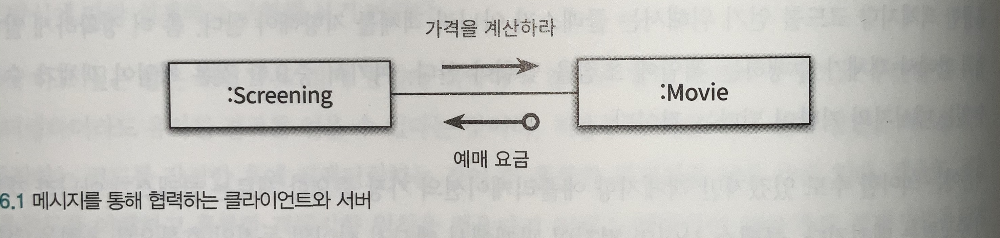
- **메시지와 메시지 전송**
  - `movie.calculateTicketPrice(screening)` 코드가 있다고 가정하자.
  - `calculateTicketPrice(screening)` 코드는 메시지
  - `movie.calculateTicketPrice(screening)` 코드는 메시지 전송에 해당한다.
- **메시지와 메서드**
  - 메시지를 수신했을 때 실제로 실행되는 함수를 메서드라고 부른다.
  - 메시지 전송자 입장에서 수신측에서 다형성에 의해 어떤 메서드가 실행될지는 모르지만, 메시지 전송자는 자신이 어떤 메시지를 전송해야 하는지만 알면된다.
    - good: `calculateTicketPrice()`
    - bad: `calculateTicketPriceByPeriodDiscount()`
  - 메시지 수신자 역시 누가 메시지를 전송했는지 알 필요가 없고, 단지 메시지가 도착했다는 사실만 알면된다.
- **퍼블릭 인터페이스와 오퍼레이션**
  - 객체가 외부에 공개하는 메시지의 집합을 퍼블릭 인터페이스라고 부른다.
  - 프로그래밍 언어 과점에서 퍼블릭 인터페이스에 포함된 메시지를 **오퍼레이션으로** 부르고 실제로 실행되는 코드를 **메서드라고** 부른다.
- **시그니처**
  - 메소드 이름과 파라미터 목록을 합쳐 시그니처(signature)라고 부른다.
  - 오퍼레이션은 코드 없이 시그니처만 정의한 것이고, 메소드는 구현을 더한 것이다.
- **정리**
  - 메시지: 객체 간 협력을 위해 사용하는 매개체. 객체의 오퍼레이션이 실행되도록 요청하는 것을 메시지 전송.
  - 오퍼레이션: 객체가 외부에 노출하는 추상적인 서비스(혹은 메서드)
  - 메서드: 메시지에 응답하기 위해 실제 실행되는 함수
  - 퍼블릭 인터페이스: 객체가 외부에 제공하는 오퍼레이션 묶음
  - 시그니처: 이름과 인자를 포함하는 오퍼레이션 or 메서드의 명세

### 6.2 인터페이스와 설계 품질

- 추상적인 인터페이스는 어떻게 수행하는지가 아니라 **무엇을 하는지를 표현**한다.
- 좋은 인터페이스를 설계하기 위해 책임주도 설계 방법을 따르자.
  - 책임 주도 설계에서는 메시지를 먼저 선택함으로써 협력에 필요한 오퍼레이션만 인터페이스에 속하게 된다.
- 퍼블릭 인터페이스의 품질에 영향을 미치는 원칙과 기법을 살펴보자.

  - **디미터 법칙 (Law of Demeter)**

    - 객체 A가 다른 객체의 내부 구조에 강하게 결합되지 않도록 협력 경로를 제한하자.
    - 낯선 자에게 말하지 말라, 오직 인접한 이웃하고만 말하라, 오직 하나의 도트(.)만 사용하라로 요약된다.
    - 디미터 법칙을 따르면 코드 레벨에서 객체 A가 메시지를 전송할 수 있는 경우는 아래 2가지 경우에 해당한다.

      - 메서드의 인자를 통해 전달된 객체
      - 객체 A가 가지고 있는 인스턴스 객체

      ```java
        public class ReservationAgency {
          public Reservation reserve(Screening screening) {
            Money fee = screening.calculateFee();
            // Reservation 반환하는 코드
          }
        }
      ```

    - 디미터 법칙의 장점
      - 디미터 법칙을 따르는 코드는 메시지 전송자 / 수신자 사이의 **낮은 결합도를 유지**할 수 있다.
      - 디미터 법칙을 따르면 `부끄럼타는 코드(shy code)`를 작성할 수 있다.
        - 다른 객체에게 불필요한 그 어떤것도 보여주지 않으며, 다른 객체의 구현에 의존하지 않는 코드
    - 디미터 법칙과 캡슐화 차이
      - 디미터 법칙은 캡슐화를 제공하기 위한 구체적인 지침을 제공한다.
    - 다음은 디미터 법칙을 위반하는 전형적인 코드이며, `기차 충돌(train wreck)`이라고도 부른다.
      - `screening.getMovie().getDiscountCondition()`
    - 무조건 디미터 법칙을 수용하면 객체의 응집도가 낮아질 수 있다. (추후 나옴)

- **묻지말고 시켜라**

  - bad

  ```ts
  export class ReservationAgency {
  public reserve(
    screening: Screening,
    customer: Customer,
    audienceCount: number,
  ) {
    const movie = screening.getMovie();
    let discountable = false;
    for (const condition of movie.getDiscountConditions()) {
      if (condition.getType() == DiscountConditionType.PERIOD) {
        discountable =
          screening.getWhenScreened().getDay() == condition.getDayOfWeek() &&
          condition.getStartTime() <= screening.getWhenScreened() &&
          condition.getEndTime() >= screening.getWhenScreened();
      } else { ... }
  ```

  - good

  ```java
    public class ReservationAgency {
      public Reservation reserve(Screening screening) {
        Money fee = screening.calculateFee();
        // Reservation 반환하는 코드
      }
    }
  ```

  - 디미터 법칙은 훌륭한 메시지는 객체에게 **묻지말고 시켜라**(Tell. Dont Ask)는 것을 장려한다.
  - 디미터 법칙과 묻지말고 시켜라 원칙은 우리에게 힌트를 제공한다.
    - 내부의 상태를 묻는 오퍼레이션이 인터페이스에 포함되어 있다면 더 나은 방법은 없는지 고민해보자.
    - 내부의 상태를 이용해 결정을 내리는 로직이 객체 외부에 존재하면, 객체가 책임질 어떤 행동이 외부로 누수된 것이다.
  - 좋은 인터페이스를 얻기 위해서는 어떻게 작업을 수행하는지를 노출해선 안 되고 **무엇을 하는지 서술해야 한다.**

- **의도를 드러내는 인터페이스**

  ```java
    public class PeriodCondition {
      public boolean isSatisfiedByPeriod() {}
    }

    public class SequenceCondition {
      public boolean isSatisfiedBySequence() {}
    }
  ```

  - 위와 같은 코드는 **2가지 문제**가 있다.
    - 클라이언트 관점에서 동일하게 할인 조건을 판단하는데, 메서드의 이름이 다르기에 클라이언트가 내부 구현을 이해하고 메서드를 선택해야 한다.
    - 메서드 이름이 변경될 때 클라이언트의 코드도 함께 변경된다.
  - 무엇을 하는지를 드러내는 메서드 이름은 이해하기 쉽고 유연한 코드를 낳는다.
    - 어떻게 수행하는지 이름을 드러내면 내부 구현을 설명하는 이름이고
    - 무엇을 하는지를 드러내면 객체가 수행해야 하는 책임에 대해 고민하게 된다.

  ```java
    public class PeriodCondition {
      public boolean isSatisfiedBy() {}
    }

    public class SequenceCondition {
      public boolean isSatisfiedBy() {}
    }
  ```

  - 위 코드는 메서드의 이름을 통해 `PeriodCondition, SequenceCondition`가 동일한 목적을 가진다는 것을 표현한다.
  - 클라이언트 관점에서 동일한 메시지를 전달하기에 수신측의 내부 구현을 알 필요가 없어진다.
  - 객체에게 묻지말고 시키되, 구현 방법이 아닌 클라이언트의 의도를 드러내야 한다.
    - 우테캠 LottoMarket의 sell or buy를 고민했던 경험
  - 켄트 백은 `Smalltalk Best Practice Patterns` 책에서 의도를 드러내는 선택자라고 표현했는데, 도메인 주도 설계에서 에릭 에반스는 켄트백의 표현을 인터페이스 레벨로 확장해선택 의도를 드러내는 인터페이스를 제시했다.

- 함께 모으기

  - 아래의 나쁜 예시를 보여주고 묻지말고 시켜라, 인터페이스에 의도를 드러내자 원칙을 적용시키는데 다들 보셨을 거라 믿는다.

  ```ts
  export class Theater {
    private ticketSeller: TickerSeller;
    constructor(ticketSeller: TickerSeller) {
      this.ticketSeller = ticketSeller;
    }

    enter(audience: Audience) {
      if (audience.getBag().hasInvitation()) {
        const ticket = this.ticketSeller.getTicketOffice().getTicket();
        audience.getBag().setTicket(ticket);
      } else {
        const ticket = this.ticketSeller.getTicketOffice().getTicket();
        audience.getBag().minusAmount(ticket.getFee());
        this.ticketSeller.getTicketOffice().plusAmount(ticket.getFee());
        audience.getBag().setTicket(ticket);
      }
    }
  }
  ```

### 6.3 원칙의 함정

- SW 설계에서 절대적인 법칙은 없다.
- 원칙이 현재 상황에 부적합하다고 생각되면 과감하게 원칙을 무시해라. 원칙을 아는 것보다 더 중요한 것은
  언제 **원칙이 유용하고 언제 유용하지 않은지 판단할 수 있는 능력**을 기르는 것이다.

---

- 디미터 법칙은 하나의 도트를 강제하는 규칙이 아니다.
  - 디미터 법칙은 **결합도**와 관련된 것이며, 객체의 내부 구조가 외부로 유출되는 경우에 한정한다.
  - `IntStream.of(1, 15, 20).filter(x -> x > 10).distinct().count()`
  - 위에서 Instream의 함수들은 다른 IntStream으로 변환할 뿐 캡슐화는 그대로 유지된다.
- 결합도와 응집도의 충돌

  - 묻지말고 시켜라와 디미터 법칙을 준수하는게 항상 좋은 건 아니다.

  ```java
    // step1
    public class PeriodCondition implements DiscoundCondition {
      public boolean isSatisfiedBy(Screening screening) {
        return screening.getStartTime().getDayOfWeek().equals(dayOfWeek) &&
          startTime.compareTo(screening.getStartTime().toLocalTime()) <= 0 &&
          endTime.compareTo(screening.getStartTime().toLocalTime()) >= 0;
      }
    }

    // step2
    public class Screening {
      public boolean isDiscountable(
        DayOfWeek dayOfWeek,
        LocalTime startTime,
        LocalTime endTime
      ) {
        // 할인이 가능한지 로직이 존재
      }
    }

    public class PeriodCondition implements DiscoundCondition {
      public boolean isSatisfiedBy(Screening screening) {
        return screening.isDiscountable(dayOfWeek, startTime, endTime);
      }
    }
  ```

  - 위 코드를 보면 묻지말고 시켜라를 준수하는 퍼블릭 인터페이스를 얻을 수 있었다.
  - 하지만 **아래와 같은 단점**이 있다.
    - Screening이 할인 조건을 판단하는 책임을 떠안게 된다.
    - Screening이 PeriodCondition의 변수를 인자로 받기 때문에 둘 간의 결합도를 높인다.
  - 이 상태에서 Screening이 캡슐화 향상보다는 Screening의 응집도를 높이고 `Screening <-> PeriodCondition` 간 결합도를 낮추는 것이 전체적으로 좋은 방법이다.
  - 협력을 위해 객체에게 시키는 것이 항상 가능한 것은 아니다. **가끔은 물어야 한다.**
  - SW 설계에 법칙은 존재하지 않는다. 원칙을 맹신하지 마라. 원칙이 적절한 상황과 부적절한 상황을 판단할 수 있는 안목을 길러라. 설계는 트레이트오프의 산물이다. SW 설계에 존재하는 몇 없는 법칙 중 하나는 **경우에 따라 다르다.** 라는 사실을 명심하자.

### 6.4 명령 쿼리 분리 원칙

- 용어 정리
  - **루틴**: 어떤 절차를 묶어 호출 가능하도록 이름을 부여한 모듈
    - **프로시저**: 부수효과를 발생시킬 수 있지만 값을 반환할 수 없다.
    - **함수**: 부수효과는 발생시킬 수 없지만 값을 반환한다.
- 명령(Command)과 쿼리(Query)는 객체의 인터페이스 측면에서 프로시저와 함수를 부르는 또 다른 이름이다.
  - **객체의 상태를 수정**하는 오퍼레이션을 명령이라 부르고
  - **객체와 관련된 정보를 반환**하는 오퍼레이션을 쿼리라고 부른다.
- 명령/쿼리 분리 원칙의 핵심은 **어떤 오퍼레이션도 명령인 동시에 쿼리여서는 안 된다.**
  - 객체의 상태를 변경하는 명령은 반환값을 가질 수 없다.
  - 객체의 정보를 반환하는 쿼리는 상태를 변경할 수 없다.
- 마틴 파울러는 명령/쿼리 분리원칙에 따라 작성된 객체의 인터페이스를
  `명령/쿼리 인터페이스(Command-Query Interface)`라고 부른다.
- **명령 쿼리 분리의 장점**

  ```java
    class A {
      isSatisfied() {
        if (check()) {
          doAnotherThing(); // 여기서 check에 사용되는 멤버 변수를 수정한다.
          return false;
        }
        return true;
      }
    }
  ```

  - 버그를 찾기 어려웠던 이유는 isSatisfied가 명령과 쿼리 두가지 역할을 동시에 수행하고 있었기 때문이다.

  ```java
    class A {
      isSatisfied() {
        if (check()) {
          return false;
        }
        return true;
      }

      doAnotherThing() {
        // 객체의 상태를 수정
      }
    }
  ```

  - 객체의 명령과 쿼리를 분리하면 인터페이스를 흝어보는 것만으로 명령과 쿼리를 구분하기 쉽다.
  - 퍼블릭 인터페이스를 설계할 때 명령과 쿼리를 분리하길 바란다.
    - 코드가 예측 가능하고, 이해하기 쉬우며, 디버깅이 쉽고, 유지보수가 수월해지는 장점을 얻게 된다.

- **명령/쿼리 분리와 참조 투명성**
  - 명령과 쿼리를 분리함으로써 **참조 투명성**의 장점을 제한적으로 누릴 수 있게 된다.
  - 참조 투명성이란 어떤 표현식(ex: f(1))이 있을 때 값(3)으로 바꾸더라도 결과가 달라지지 않는 특성
    - f(1) + f(1) = 6
    - 3 + 3 = 6
  - f(1)의 값이 항상 3이라고 말할 수 있는 이유는 f(1)의 값이 변하지 않기 때문인데, 이처럼 어떤 값이 변하지 않는 성질을 불변성이라고 부른다.
  - 즉, **참조 투명성을 가진다면 불변성을 가지게 되고 부수효과가 발생하지 않는다**는 뜻이다.
  - 명령/쿼리 분리 원칙을 사용하면 부수효과를 가지는 명령으로부터 쿼리를 명백하게 분리함으로써 제한적이나마 참조 투명성의 혜택을 누릴 수 있다. `doAnotherThing`을 호출하지 않는 한 `isSatisfied` 메서드를 어떤 순서로 몇 번 호출하건 결과는 동일하다.
- **책임에 초점을 맞춰라**
  - 책임주도 설계 방법에 따라 메시지가 객체를 결정하게 하라. 아래의 원칙들을 잘 지킬수 있다.
    - 디미터 법칙
    - 묻지말고 시켜라
    - 의도를 드러내는 인터페이스
    - 명령/쿼리 분리 원칙

## 7. 객체 분해

- 불필요한 정보를 제거하고 현재의 문제 해결에 필요한 핵심만 남기는 작업을 **추상화**라고 부른다.
- 일반적인 추상화 방법은 한 번에 다뤄야 하는 문제의 크기를 줄이는 것이다. 사람들은 커다란 문제를 만났을 때 해결 가능한 작은 문제로 나누는 경향이 있다. 이 처럼 큰 문제를 작은 문제로 나누는 작업을 **분해**라고 한다.
- **추상화와 분해**는 가장 복잡한 분야의 문제를 해결하기 위해 사용돼 왔다. 그 중 한 분야가 SW 개발 영역이다.

### 7.1 프로시저 추상화와 데이터 추상화

- 현대적인 프로그래밍 언어를 특정 짓는 중요한 추상화 메커니즘은 프로시저 추상화와 데이터 추상화다.
- 프로시저 추상화는 SW가 무엇을 해야 하는지 추상화하고, 데이터 추상화는 SW가 무엇을 알아야 하는지 추상화한다.
- SW는 데이터를 이용해 정보를 표현하고, 프로시저를 이용해 데이터를 조작한다.

### 7.2 프로시저 추상화와 기능 분해

- 전통적인 기능 분해 방법은 **하향식 접근법**을 따른다. 시스템을 구성하는 가장 최상위 방법을 정의하고, 좀 더 작은 단계의 하위 기능으로 분해해 나가는 방법을 말한다.
- 급여 관리 시스템을 구현하기 위해 기능 분해 방법을 이용해보자. 전통적으로 하향식 접근법을 따르며 최상위의 추상적인 함수 정의에서 출발해 단계적인 정제 절차를 따라 시스템을 구축하면 아래와 같은 흐름으로 구현된다.

```js
// step 1
직원의 급여를 계산한다

// step 2
직원의 급여를 계산한다
  사용자로부터 소득세율을 입력받는다
  직원의 급여를 계산한다
  양식에 맞게 결과를 출력한다

// step 3
직원의 급여를 계산한다
  사용자로부터 소득세율을 입력받는다
    "세율을 입력하세요" 라는 문장을 화면에 출력한다
    키보드를 통해 세율을 입력받는다
  직원의 급여를 계산한다
    전역 변수에 저장된 직원의 기본급 정보를 얻는다
    급여를 계산한다
  양식에 맞게 결과를 출력한다
    "이름: 직원명, 급여: 계산된 금액" 형식에 따라 문자열을 출력한다.
```

- 하향식 분해는 논리적이고 체계적인 시스템 개발 절차를 제시한다. 문제는 우리가 사는 세계는 그렇게 체계적이지도, 이상적이지도 않다는 점이다. **하향식 기능 분해 방법을 적용하다 보면 아래와 같은 문제**에 직면한다.
  - 기능 추가나 요구사항 변경으로 인해 메인 함수를 빈번하게 수정해야 한다.
  - 비지니스 로직이 사용자 인터페이스와 강하게 결합된다.
  - 하향식 분해는 이른 시기에 함수들의 실행 순서를 고정시키기 때문에 유연성과 재사용성이 저하된다.
- 설계는 코드 배치 방법이며 설계가 필요한 이유는 변경에 대비하기 위한 것이라는 점을 기억하라. 하향식 접근법은 변경에 취약한 설계를 낳는다는 문제가 있다.
- 하향식 분해는 작은 프로그램과 개별 알고리즘을 위해서는 유용한 패러다임이지만 커다른 SW를 설계하는데 적합한 방법은 아니다.

### 7.3 모듈

- 시스템의 변경을 관리하는 기본적인 전략은 함께 변경되는 부분을 하나의 구현 단위로 묶고 퍼블릭 인터페이스를 통해서만 접근하도록 만드는 것이다.
- **정보 은닉**은 SW 개발의 가장 중요한 원리인 동시에 가장 많은 오해를 받고 있는데, 정보 은닉은 시스템에서 자주 변경되는 부분을 상대적으로 덜 변경되는 안정적인 인터페이스 뒤로 감춰야 한다는 것이 핵심이다.
- **정보 은닉**은 외부에 감춰야 하는 비밀에 따라 시스템을 분할하는 모듈 분할 원리다. 모듈은 다음과 같은 두 가지 비밀을 감춰야 한다.
  - 복잡성
    - 모듈이 너무 복잡한 경우 이해하고 사용하기가 어렵다. 외부에 모듈을 추상화할 수 있는 간단한 인터페이스를 제공해서 모듈의 복잡도를 낮춘다.
  - 변경 가능성
    - 변경 가능한 설계 결정이 외부에 노출될 경우, 실제로 변경이 발생했을 때 파급효가가 커진다.
    - 변경 가능한 설계 결정을 모듈 내부로 감추고, 쉽게 변경되지 않을 인터페이스를 외부에 노출한다.
- 모듈은 감춰야 할 데이터를 결정하고, 데이터를 조작하는데 필요한 함수를 결정한다. 모듈은 데이터와 함수가 통합된 한 차원 높은 추상화를 제공하는 설계 단위다.
- 모듈이 프로시저 추상화보다는 높은 추상화 개념을 제공하지만 인스턴스의 개념을 제공하지 않는다. 예시에서 나온 것 처럼 개별 직원이 아니라 회사에 속한 모든 직원 정보를 가질 뿐이다. 이를 위해 추상 데이터 타입이 나왔다.

### 7.4 데이터 추상화와 추상 데이터 타입

- 개별 인스턴스를 생성할 수 있는 추상 데이터 타입은 좀 더 사람들의 사고방식에 가깝다.
- 비록 추상 데이터 타입을 기반으로 객체를 생성하는 것은 가능하지만 여전히 데이터와 기능을 분리해서 바라본다는 점에 주의해라. 추상 데이터 타입은 말 그대로 시스템의 상태를 저장할 데이터를 표현한다.

### 7.5 클래스

- **클래스는 추상 데이터 타입인가?**
  - 많은 서적에서 클래스를 추상 데이터 타입으로 설명한다. 설명이 꼭 틀린 것은 아니지만 명확하게 말하면 추상 데이터 타입과 클래스는 동일하지 않다.
  - **가장 핵심적인 차이는** 클래스는 상속과 다형성을 지원하는데 추상 데이터 타입은 지원하지 못한다는 점이다.
- **추상 데이터 타입**은 타입을 추상화 한 것이고 **클래스는** 절차를 추상화한 것이다.
  - Employee 타입이 있고, 내부에 정규직원과 아르바이트 직원의 월급계산 로직이 다르다고 가정하자.
  - Employee 타입은 구체적인 직원 타입을 외부에 캡슐화하고 있고, 이처럼 하나의 대표적인 타입이 다수의 세부적인 타입을 감추기 때문에 타입 추상화라고 불렀다. 타입 추상화를 기반으로 하는 대표적인 기법이 추상 데이터 타입이다.
  - 반대로 객체지향은 정규 직원과 아르바이트 직원 각각에 대한 클래스를 정의하고 다형성을 이용할 것이다. 실제로 내부에서 수행되는 절차는 다르지만 클래스를 이용한 다형성은 절차에 대한 차이를 감춘다. 다시 말해 객체지향은 절차 추상화이다.
- 변경을 기준으로 선택하라
  - 클래스를 사용하더라도 타입을 기준으로 절차를 추상화하지 않았다면 그것은 객체지향 분해가 아니다.
  - 객체지향에서는 조건문을 다형성으로 대체하는데, 그 이유는 변경 때문이다.
    - 추상 데이터 타입은 새로운 Employee를 추가하기 위해 조건문을 찾아 수정해야 하지만
    - 객체지향은 Employee를 상속하는 클래스를 새로 추가하면 된다. 이는 새로운 로직을 추가하기 위해 클라이언트 코드를 수정할 필요가 없다는 것을 의미한다.
  - 이처럼 기존 코드에 영향을 미치지 않고 새로운 객체를 추가할 수 있는 특성을 `개방-폐쇄 원칙(Open-closed Principle, OCP)`이라 부른다.
  - 새로운 타입을 빈번하게 추가한다면 객체지향의 클래스가 유용하고, 새로운 오퍼레이션을 빈번하게 추가한다면 추상 데이터 타입을 선택하는 것이 현명하다.
- 협력이 중요하다.
  - 위에서 설명한 추상 데이터 타입과 클래스는 차이를 보여주기 위해 설명한 것이지, 객체를 설계하는 방법을 설명한 것은 아니다. 객체를 설계하는 방법은 **책임 주도 설계의 흐름**을 따른다는 점을 기억해라.
  - 객체가 참여할 협력을 결정하고, 협력에 필요한 책음을 수행하기 위해 어떤 객체가 필요한지에 관해 고민해라. 그 책임을 다양한 방식으로 수행해야 할 때만 타입 계층안에 각 절차를 추상화해라.

## 8. 의존성 관리하기

- 협력은 필수적이지만 과도한 협력은 설계를 곤경에 빠트릴 수 있다. 협력은 객체가 다른 객체에 대해 알 것을 강요한다. 객체지향 설계의 핵심은 협력을 위해 **필요한 의존성을 유지하면서도 변경을 방해하는 의존성은 제거**하는데 있다.

### 8.1 의존성 이해하기

- 어떤 객체가 협력하기 위해 다른 객체를 필요로 할 때 두 객체 사이의 의존성이 존재하게 된다.
- 의존성은 방향성을 가지며 항상 **단방향이다**. 아래 코드에서 Screening이 변경될 때 PeriodCondition이 영향을 받게 되지만 그 역은 성립하지 않는다.

```java
    public class PeriodCondition implements DiscoundCondition {
      public boolean isSatisfiedBy(Screening screening) {
        return screening.getStartTime().getDayOfWeek().equals(dayOfWeek) &&
          startTime.compareTo(screening.getStartTime().toLocalTime()) <= 0 &&
          endTime.compareTo(screening.getStartTime().toLocalTime()) >= 0;
      }
    }
```

- 의존성은 전이될 수 있다. PeriodCondition이 Screening에 의존할 경우 PeriodCondition은 Screening이 의존하는 대상에 대해서도 자동적으로 의존하게 된다는 것이다. 다시 말해 Screening이 가지고 있는 의존성이 PeriodCondition으로도 전파된다는 것이다.
- 아래에서 Movie 클래스는 할인 정책을 구현한 두 클래스를 모르지만 실행시점의 Movie 객체는 두 클래스의 인스턴스와 협력할 수 있다. 이것이 핵심이다. 유연하고 재사용 가능한 설계를 만들기 위해, 동일한 소스코드 구조를 가지고 다양한 실행 구조를 만들수 있어야 한다.
  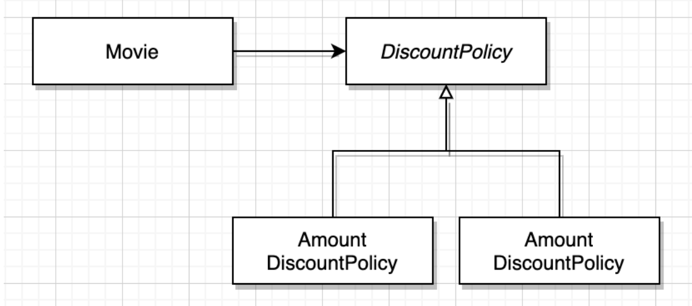
- 의존성 해결

  - 컴파일 타임 의존성은 구체적인 런타임 의존성으로 대체돼야 한다. 위에서 Movie 클래스는 DiscountPolicy 클래스에 의존하는데 이는 컴파일타임 의존성이다. 실행 시점에 Movie는 AmountDiscountPolicy 또는 PercentDiscountPolicy 인스턴스에 의존하는데 이는 런타임 의존성이다.
  - 이처럼 컴파일 타임 의존성을 적절한 런타임 의존성으로 교체하는 것을 **의존성 해결**이라 부른다. 의존성을 해결하기 위해 일반적으로 아래와 같은 **세가지 방법**을 사용한다.
    - 객체를 생성하는 시점에 생성자를 통해 의존성 해결
    - 객체 생성후 setter 메소드를 통해 의존성 해결
    - 메서드 실행 시 인자를 이용해 의존성 해결
  - 영화 요금 계산에 금액 할인 정책을 적용하고 싶다면 Movie 객체를 생성할 때 AmountDiscountPolicy를 생성자에 전달하면 된다.

  ```js
    // 금액 할인 정책
    Movie avatar = new Movie("아바타", new AmountDiscountPolicy(...))

    // 퍼센트 할인 정책
    Movie avatar = new Movie("아바타", new PercentDiscountPolicy(...))

    // Movie 클래스는 선택적으로 받을 수 있게 DiscountPolicy 타입의 인자를 받는다.
    public class Movie {
      public Movie(title: string, discountPolicy: DiscountPolicy) {
        this.discountPolicy = discountPolicy;
      }
    }
  ```

  - setter 메소드를 이용해 의존하는 대상을 변경할 수 있는데, 객체를 생성한 이후에 의존하고 있는 대상을 변경하고 싶다면 유용하다. 이때 객체를 생성하고 의존성을 설정하기 전까지 객체의 상태가 불완전할 수 있다. 따라서 생성자 방식과 setter 방식을 혼합하는 것이 좋다. 객체 생성시 항상 의존성을 넣어 완전한 상태의 객체를 생성한 후, 필요에 따라 setter 메소드를 이용해 의존 대상을 변경할 수 있다.
  - Movie가 항상 할인 정책을 알필요는 없고 가격을 계산할 때만 일시적으로 알아도 무방하다면 메서드의 인자를 이용해 의존성을 해결할 수도 있다.

  ```js
    public class Movie {
      public calculateMovieFee(
        screening: Screening,
        discountPolicy: DiscountPolicy
      ) {}
    }
  ```

  - 메서드 인자를 사용하는 방식은 협력 대상에 대해 지속적으로 의존관계를 맺을 필요 없이 메서드가 실행되는 동안만 일시적으로 의존 관계가 존재해도 무방하거나, 메서드가 실행될 때마다 의존 대상이 매번 달라져야 하는 경우 유용하다.

### 8.2 유연한 설계

- **의존성과 결합도**
  - 코드에서 Movie가 AmountDiscountPolicy에 직접적으로 의존한다면, 의존성이 존재하는 것은 바람직하다. 문제는 의존성의 존재가 아니라 의존성의 정도다. AmountDiscountPolicy라는 구체적인 클래스에 의존하게 만들었기 때문에 다른 종류의 정책이 필요할 때 Movie를 재사용 할 수 없다.
- **추상화에 의존하라**
  - DiscountPolicy 클래스는 AmountDiscountPolicy 클래스가 금액 할인 정책에 따라 할인 요금을 계산한다는 사실을 숨겨주기 때문에 AmountDiscountPolicy의 추상화다.
  - 아래 목록에서 아래쪽으로 갈수록 클라이언트가 알아야 하는 지식양이 적어지기 때문에 결합도가 느슨해진다.
    - 구체 클래스 의존성
    - 추상 클래스 의존성
    - 인터페이스 의존성
  - 실행 컨텍스트에 대해 알아야 하는 정보를 줄일수록 결합도가 낮아진다. 결합도를 느슨하게 만들기 위해서는 구체적인 클래스보다 추상 클래스에, 추상 클래스보다 인터페이스에 의존하도록 만드는 것이 더 효과적이다. 결국 의존하는 대상이 더 추상적일수록 결합도는 낮아진다는 것이다.
- **명시적인 의존성**

  - 아래 코드는 생성자 안에서 의존성을 생성하는 방식으로,Movie가 `AmountDiscountPolicy`에 의존한다는 사실을 감춘다. 이를 **숨겨진 의존성**이라고 한다.

  ```js
  public class Movie {
    private DiscountPolicy discountPolicy;
    public Movie(title: string) {
      this.discountPolicy = new AmountDiscountPolicy();
    }
  }
  ```

  - 생성자, setter, 메서드 인자를 사용하는 경우 의존성이 public 인터페이스에 드러나게 되는데 이를 **명시적인 의존성**이라고 부른다.
  - 의존성이 명시적이지 않으면 의존성을 파악하기 위해 내부 구현을 직접 살펴볼 수 밖에 없고, 변경이 발생할 때 내부 구현을 직접 변경해야 할 수 있다. **코드 수정은 언제나 잠재적으로 버그의 발생 가능성을 내포**한다.
  - 의존성은 명시적으로 표현돼야 한다. 의존성을 내부 구현에 숨겨두지 마라. **유연하고 재사용 가능한 설계란 퍼블릭 인터페이스를 통해 의존성이 명시적으로 드러나는 설계**다. 숨겨져 있는 의존성을 밝은 곳으로 드러내서 널리 알려라. 그러면 설계가 유연하고 재사용 가능해 질 것이다.

- new는 해롭다.

  - 클라이언트에서 new 연산자를 사용하면 구체 클래스의 이름과, 어떤 인자를 이용해 클래스의 생성자를 호출해야 하는지 알아야 하기 때문에 결합도가 높아진다.

  ```js
    public class Movie {
      private discountPolicy: DiscountPolicy;
      public Movie(title: String, fee: Money) {
        this.discountPolicy = new AmountDiscountPolicy(
          Money.wons(800),
          new SequenceCondition(1),
          new SequenceCondition(10),
          new PeriodCondtion(DayofWeek.MONDAY, LocalTime.of(10, 0)),
          new PeriodCondtion(DayofWeek.FRIDAY, LocalTime.of(20, 59)),
        )
      }
    }
  ```

  - 위 코드에서 Movie는 `AmountDiscountPolicy와` 결합도가 높다. 결합도가 높으면 변경에 의해 영향을 받기도 쉬워진다. `AmountDiscountPolicy의` 생성자 인자 목록이나 순서가 바뀌면 필시 Movie도 수정을 해야 한다. 이게 높은 결합도를 피해야 하는 이유다.
  - 해결 방법은 인스턴스를 생성하는 로직과 사용하는 로직을 분리하는 것이다. Movie가 인스턴스를 생성하지 말고 위에서 많이 봐왔던 예시처럼 생성자를 통해 `DiscountPolicy로` 전달받아 사용하기만 해야 한다.

- 사용과 생성의 책임을 분리하고, 의존성을 생성자에 명시적으로 드러내고, 구체 클래스가 아닌 추상 클래스에 의존하게 함으로써 설계를 유연하게 만들 수 있다.
- 가끔은 생성해도 무방하다.

  - 클래스 안에서 객체를 직접 생성하는 게 유용한 경우도 있다. 예를 들어 Movie가 대부분 `AmountDiscountPolicy의` 인스턴스와 협력하고 가끔씩만 `PercentDiscountPolicy` 인스턴스와 협력한다고 가정해보자. 이 상황에서 인스턴스 생성 책임을 클라이언트로 옮긴다면 클라이언트들 사이에 중복 코드가 늘어나고 Movie 사용성도 나빠질 것이다.
  - 이 문제를 해결하는 방법은 기본 객체를 생성하는 생성자를 추가하고, 체이닝 하는 것이다.

  ```js
    public class Movie {
      private DiscountPolicy discountPolicy;
      public Movie(title: string) {
        this(title, new AmountDiscountPolicy(...))
      }

      public Movie(title: string, discountPolicy: DiscountPolicy) {
        this.discountPolicy = new discountPolicy();
      }
    }
  ```

  - 여기서 첫번째 생성자가 두번째 생성자를 호출한다. 즉 생성자가 체인처럼 연결된다. 이제 클라이언트는 대부분 `AmountDiscountPolicy`의 인스턴스와 협력하게 하면서도 가끔씩 `DiscountPolicy`의 인스턴스로 의존성을 교체할 수 있다.
  - 위 예는 설계가 트레이드 오프 활동이라는 사실을 다시 한번 상기시킨다. 구체클래스에 의존하게 되더라도 클래스의 사용성이 더 중요하다면 결합도를 높이는 방향으로 코드를 작성할 수 있다.

- 표준 클래스에 대한 의존은 해롭지 않다.

  - 의존성이 불편한 이유는 그것이 항상 변경에 대한 영향을 암시하기 때문이다. 따라서 변경될 확률이 거의 없는 클래스라면 의존성이 문제가 되지 않는다.
  - 예를 들어 자바 라이브러리의 `ArrayList`의 경우 다음과 같이 직접 생성해서 대입하는 것이 일반적이다.

    ```java
      public abstract class DiscountPolicy {
        private List<DiscountCondition> conditions = new ArrayList();
      }
    ```

  - 비록 클래스를 직접 생성하더라도 가능한 추상적인 타입을 사용하는게 확장성 측면에서 좋다. 위 코드에서 List를 사용한 것은 이 때문이다. 이렇게 하면 다양한 List 타입의 객체로 conditions를 대체할 수 있게 설계의 유연성을 높일 수 있다.

## 9. 유연할 설계

### 9.1 개방-폐쇄 원칙

- 로버트 마틴은 확장 가능하고 변화에 유연한 설계를 위한 원칙 중 하나로 **개방-폐쇄 원칙(Open-Closed Principle, OCP)** 을 고안했다. 개방 폐쇄 원칙을 요약하면 **소프트웨어 개체는 확장에 대해 열려있어야 하고, 수정에 대해서는 닫혀 있어야 한다**.
- 여기서 키워드는 확장과 수정이다.
  - 확장에 대해 열려있다. 요구사항이 변경될 때, 새로운 동작을 추가해 어플리케이션을 확장할 수 있다.
  - 수정에 대해 닫혀있다. 기존의 코드를 수정하지 않고도 애플리케이션 동작을 추가하거나 변경할 수 있다.
- 어떻게 코드를 수정하지 않고도 새로운 동작을 추가할 수 있을까?

  - **컴파일타임** 의존성을 고정시키고 **런타임** 의존성을 변경하라
    - **사실 OCP는** 런타임 의존성과 컴파일타임 의존성에 관한 이야기다.
    - 앞의 영화 예매 시스템을 상기해보자. 컴파일 타임 의존성 관점에서 Movie 클래스는 추상클래스인 `DiscountPolicy에` 의존한다. 런타임 의존성 관점에서는 Movie 인스턴스는 `AmountDiscountPolicy`와 `PercentDiscountPolicy` 인스턴스에 의존한다. 즉 컴파일과 런타임 의존성이 동일하지 않고 OCP 원칙을 따르고 있다.
    - 여기서 중복 할인 정책을 추가한다고 가정하면, `DiscountPolicy`의 자식 클래스로 `OverlappedDiscountPolicy` 클래스를 추가한 것 뿐이다. 기존의 어떤 코드도 수정하지 않았다. `NoneDiscountPolicy`도 마찬가지다. 기존 코드를 손대지 않은 채 할인 정책이 적용되지 않은 영화를 구현할 수 있었다.
  - 추상화가 핵심이다.

    - OCP의 핵심은 추상화에 의존하는 것이다. 이해를 돕기 위해 아래 코드를 보자.

    ```js
      public abstract class DiscountPolicy {
        private List<DiscountCondition> conditions = new ArrayList();

        public calculateDiscountAmount(screening: Screening) {
          for (let each of conditions) {
            if (each.isSatisfied(screening)) {
              return getDiscountFee(screening);
            }
          }

          return screening.getMovieFee();
        }

        abstract protected getDiscountAmount(screening: Screening);
      }
    ```

    - 위 코드에서 변하지 않는 부분은 할인여부를 판단하는 `isSatisfied`이고 변하는 부분은 할인된 요금을 계산하는 방법 `getDiscountAmount`이다. 여기서 변하는 부분을 고정하고 변하지 않는 부분을 생략하는 추상화가 OCP 원칙의 기반이 된다는 사실에 주목하자.

### 9.2 생성 사용 분리

```js
  public class Movie {
    private DiscountPolicy discountPolicy;
    public Movie(title: string) {
      this.discountPolicy = new AmountDiscountPolicy();
    }

    public calculateMovieFree(screening: Screening) {
      return fee.minus(discountPolicy.calculateDiscountAmount(screening));
    }
  }
```

- 위 코드에서 할인 정책을 변경하려면 `AmountDiscountPolicy를` 생성하는 부분을 직접 수정하는 것 뿐이다. 이것은 동작을 추가/변경 하기 위해 기존의 코드를 수정하므로 OCP 원칙을 위반한다.
- 동일한 클래스 안에서 객체의 생성과 사용이라는 두 가지 의도를 가진 코드가 문제이다. 유연하고 재사용 가능한 설계를 원한다면 객체를 생성과 사용을 분리해야 한다.

  - 객체의 사용으로부터 생성을 분리하는 가장 보편적인 방법은, 객체를 생성할 책임을 클라이언트로 옮기는 것이다.

  ```js
    public class Client {
      public getAvatarFee() {
        Movie avatar = new Movie('아바타', new AmountDiscountPolicy(...))
        return avatar.getFee();
      }
    }
  ```

- 순수한 가공물에게 책임 할당하기
  - 모든 책임을 도메인 객체에게 할당하면 낮은 응집도, 높은 결합도, 재사용성 저하와 같은 문제에 봉착하게 된다.
  - 도메인 개념을 표현한 책임이 아니라면, 설계자의 편의를 위해 임의로 만들어낸 가공의 객체에게 책임을 할당해서 문제를 해결할 수 있다.
  - 크레이크 라만은 이처럼 책임을 할당하기 위해 도메인과 무관한 인공적인 객체를 `PURE FABRICATION(순수한 가공물)` 이라고 부른다.

### 9.3 의존성 주입

- 인스턴스를 사용하는 객체가 아닌 외부의 객체가 인스턴스를 생성한 후, 이를 전달해서 의존성을 해결하는 방법을 **의존성 주입**이라고 부른다.
- 의존성 주입은 의존성을 객체의 퍼블릭 인터페이스에 명시적으로 드러내서 외부에서 필요한 런타임 의존성을 전달할 수 있도록 만드는 방법을 포괄하는 명칭이다. 따라서 의존성 주입에는 **의존성을 해결하는 세 가지 방법**을 별도로 정의한다.
  - **생성자 주입**: 객체를 생성하는 시점에 생성자를 통해 의존성 해결
  - **setter 주입**: 객체 생성 후, setter 메서드를 통한 의존성 해결
  - **메서드 주입**: 메서드 실행 시 인자를 이용한 의존성 해결
- 숨겨진 의존성은 나쁘다
  - 의존성 주입 외에도 의존성을 해결할 수 있는 다양한 방법이 있는데 그 중 대표적인 방법은 `SERVICE LOCATOR` 패턴이다.
  - 하지만 `SERVICE LOCATOR` 패턴은 의존성을 감춘다는 단점이 있어 저자는 선호하질 않는데, 가급적 의존성은 명시적이고 퍼블릭 인터페이스에 노출해야 한다. 의존성을 구현 내부에 숨기면 숨길수록 코드를 이해하기도, 수정하기도 어려워진다.

### 9.4 의존성 역전 원칙

```js
  public class Movie {
    private discountPolicy: AmountDiscountPolicy;
  }
```

- 위 코드에서 Movie는 구체 클래스에 대한 의존성을 가지고 있다.
- Movie는 가격 계산이라는 더 높은 수준의 개념을 구현한다. `AmountDiscountPolicy`는 영화의 가격에서 특정 금액만큼 할인하는 더 구체적인 수준의 메커니즘을 담당한다. 즉 상위 클래스인 Movie가 하위 클래스인 `AmountDiscountPolicy`에 의존하는 문제가 있다.
  - 상위 수준의 클래스는 어떤 방식이든 하위 수준의 클래스에 의존해서는 안 된다.
  - 재사용성에도 문제가 있다. Movie를 재사용하기 위해서는 `AmountDiscountPolicy` 역시 재사용해야 한다.
- 이 경우도 추상화에 의존하도록 수정하면 하위 수준의 클래스 변경으로 상위 수준의 클래스가 영향을 받는 것을 방지할 수 있다.
- 지금까지 내용을 정리해서 아래 2가지를 의존성 역전 원칙이라고 부른다. (역전이라는 단어를 사용한 이유는, 전통적인 절차형 프로그래밍과는 반대의 의존성 방향이 나타나기 때문이다.)
  - 상위 수준의 모듈은 하위 수준의 모듈에 의존해서는 안 되고 둘다 추상화에 의존해야 한다.
  - 추상화는 구체적인 사항에 의존해선 안 되고, 구체적인 사항은 추상화에 의존해야 한다.
- 의존성 역전 원칙과 패키지
  - 아래 그림에서 Movie, `AmountDiscountPolicy, PercentDiscountPolicy`는 모두 추상 클래스인 `DiscountPolicy`에 의존한다. OCP 원칙도 지키고 유연한 설계라고 생각하지만, Movie를 재사용하기 위해 불필요한 클래스들이 Movie와 함께 배포되어야 한다.
    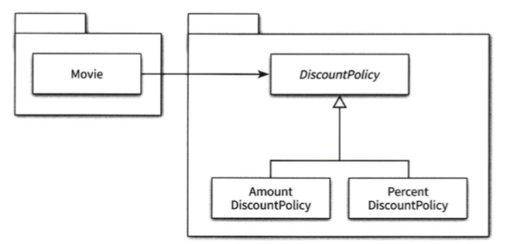
  - Movie를 컴파일 하기 위해 `DiscountPolicy` 클래스가 필요하다. 문제는 `DiscountPolicy`가 포함된 패키지 안에 `AmountDiscountPolicy, PercentDiscountPolicy` 클래스가 포함돼 있다는 것이다.
  - 컴파일 측면에서는 `DiscountPolicy`가 포함된 패키지 안의 어떤 클래스가 수정되더라도 패키지 전체가 재배포 되어야 한다. 이로 인해 패키지에 의존하는 Movie 클래스가 포함된 패키지 역시 재컴파일 되야 한다. 결과적으로 불필요한 클래스를 같은 패키지에 두는 것은 전체적인 빌드 시간을 상승시킨다.
  - 따라서 추상화를 클라이언트가 속한 패키지에 포함시켜야 한다. 그리고 재사용될 필요가 없는 클래스들`(AmountDiscountPolicy, PercentDiscountPolicy)`은 별도의 패키지에 모아야 하는데, 마틴 파울러는 이를 SEPARATED INTERFACE 패턴이라 부른다.
    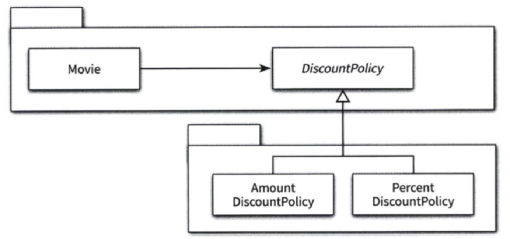
  - Movie와 추상 클래스인 `DiscountPolicy`를 하나의 패키지로 모으는 것은 Movie를 특정한 컨텍스트로부터 완벽하게 독립시킨다. Movie를 다른 컨텍스트에서 재사용하기 위해서는 Moive와 `DiscountPolicy`가 포함된 패키지만 재사용하면 된다.
- 전통적인 패러다임에서 상위 모듈이 하위 모듈에 의존했다면 객체지향 패러다임에선 상위 수준의 모듈과 하위 수준의 모듈이 모두 추상화에 의존한다. 훌륭한 객체지향 설계를 위해서는 의존성을 역전시켜야 한다.

### 9.5 유연성에 대한 조언

- 유연한 설계는 유연성이 필요할 때만 옳다.
  - 유연한 설계라는 말의 이면에는 복잡한 설계라는 의미가 숨어있다. 이 설계가 복잡한 이유는 무엇인가? 어떤 변경에 대비하기 위해 설계를 복잡하게 만들었을까? 정말 유연성이 필요할까?
  - 설계의 미덕은 단순함과 명확함으로부터 나온다. 하지만 유연함은 단순성과 명확성의 희생 위에서 자란다.

## 10. 상속과 코드 재사용

- 객체지향 프로그래밍에서 중복을 제거하기 위해 사용하는 상속과 합성을 알아보자.

### 10.1 상속과 중복코드

- DRY 원칙
  - 중복 코드는 변경을 방해한다. 이것이 중복 코드를 제거해야 하는 가장 큰 이유다.
  - DRY는 `Don't Repeat Yourself`의 약자로 코드에 중복이 존재해서는 안된다는 것이다.
- 중복과 변경
  - phone 이라는 인스턴스가 통화 요금을 계산하는 `calculateFee라는` 메소드가 있다고 가정하자.
  - 심야 할인 요금제를 구현하기 위해 기존 코드를 복사해 `NightDiscountPhone` 클래스를 만들어보자.
  - 만들어 놓으면 중복코드가 가지는 단점들을 알 수 있다.
    - 어떤 코드가 중복인지 파악하는 일이 쉽지 않으며
    - 중복 코드는 항상 같이 수정돼어야 하기 때문에 하나라도 빠트린다면 버그로 이어질 가능성이 높다.
- 상속을 이용해 중복 코드 제거하기
  - 상속은 코드를 복사하지 않고 상속을 이용해 코드를 재사용한다.
  - 앞에서 다룬 것처럼 자식 클래스가 부모 클래스의 구현 방법에 대한 정확한 지식을 가져야 하기 때문에 **강한 결합도**를 가지는 문제가 있다.

### 10.2 취약한 기반 클래스 문제

- 상속은 자식 클래스를 점진적으로 추가해 기능을 확장하는 데는 용이하지만, 높은 결합도로 부모 클래스를 점진적으로 개선하는 것은 어렵게 만든다. 이처럼 부모 클래스의 변경에 의해 자식 클래스가 영향을 받는 현상을 `취약한 기반 클래스 문제`라고 부른다.
- 상속이 가지는 **몇 가지 사례**들을 살펴보자
  - 불필요한 인터페이스 상속문제
    - 자바에서 vector의 코드를 재사용하기 위해 stack을 vector의 자식 클래스로 만들었다.
    - stack은 vector의 public 인터페이스를 상속받기 때문에 임의의 요소를 추가하거나 삭제할 수 있어 stack의 규칙을 쉽게 위반할 수 있다.
    - 즉 상속받은 부모 클래스의 메서드가 자식 클래스의 내부 구조에 대한 규칙을 깨트릴 위험이 있다.
  - 메서드 오버라이딩 오작용 문제
    - 자식 클래스가 부모 클래스의 메서드를 오버라이딩 할 경우, 부모 클래스의 메서드를 사용하는 방법에 자식 클래스가 결합될 수 있다.
- 결합도란 다른 대상에 대해 알고 있는 지식의 양이다. 상속은 기본적으로 부모 클래스의 구현을 재사용하기 위해 자식 클래스가 부모 클래스 내부에 속속이 알도록 강요한다. 즉, 코드 재사용을 위한 상속은 결합도가 높아져 함께 수정해야 하는 상황이 더 많이 발생한다.

### 10.3 phone 다시 살펴보기

- 상속을 적용하면 취약한 기반 클래스 문제를 완전히 없앨 수는 없지만, 위험을 완화시키는 것은 가능하다. 열쇠는 **추상화다**.
- 추상화에 의존하자
  - 자식 클래스가 부모 클래스의 구현이 아닌 추상화에 의존하도록 만든다. 정확히는 부모/자식 클래스 모두 추상화에 의존해야 한다.
- 차이를 메서드로 추출하라
  - 중복 코드 안에서 차이점을 별도의 메소드로 추출하자.
  - 중복 코드를 추상 클래스로 올리고 부모/자식이 추상 클래스를 상속받도록 한다.

### 10.4 차이에 의한 프로그래밍

- 상속은 이미 존재하는 클래스를 기반으로 다른 부분을 구현함으로써 새로운 기능을 쉽고 빠르게 추가할 수 있다.
- 이처럼 기존 코드와 다른 부분을 추가함으로써 애플리케이션 기능을 확장하는 방법을 **차이에 의한 프로그래밍**이라고 부른다.
- 상속의 오용과 남용은 **어플리케이션을 이해하고 확장하기 어렵게** 만든다. 정말로 필요한 경우메나 상속을 사용하라.

## 11. 합성과 유연한 설계

- 합성은 구현에 의존하지 않는다는 점에서 상속과 다르다. 상속은 부모 클래스에 구현된 코드를 재사용하지만 합성은 포함되는 객체의 퍼블릭 인터페이스를 재사용한다. 즉 합성은 구현에 대한 의존성을 인터페이스에 대한 의존성으로 변경할 수 있고 결합도를 낮출 수 있다.

### 11.1 상속을 합성으로 변경하기

- 상속을 합성으로 바꾸는 방법은 간단한데, 자식 클래스에 선언된 상속관계를 제거하고 부모 클래스의 인스턴스를 자식 클래스의 인스턴스 변수로 선언하면 된다.
- 구현에 대한 결합보다는 인터페이스에 대한 결합이 더 좋다는 사실을 기억하자.

### 11.2 상속으로 인한 조합의 폭발적인 증가

- 상속의 남용으로 하나의 기능을 추가하기 위해 필요 이상으로 많은 클래스를 추가하는 경우를 클래스 폭발문제 라고 부른다.
- 컴파일 타임에 결정된 부모/자식 관계는 변경될 수 없기 때문에 자식 클래스와 부모 클래스의 다양한 조합이 필요한 상황에서 유일한 해결 방법은 조합의 수만큼 새로운 클래스를 추가하는 것이다.
- 클래스 폭발 문제는 기능을 추가하거나 수정할 때 문제가 되며, 문제를 해결할 최선의 방법은 상속을 포기하는 것이다.

### 11.3 합성 관계로 변경하기

- 상속 관계는 컴파일 타임에 결정되고 고정되기 때문에 코드를 실행하는 도중에 변경할 수 없다. 합성은 사용하면 컴파일 타임 관계를 런타임 관계로 변경할 수 있고 구현이 아닌 퍼블릭 인터페이스에 의존할 수 있어 유연한 설계가 가능해진다.
- 코드를 재사용하면서도 건전한 결합도를 유지할 수 있는 더 좋은 방법은 합성이다. 상속이 구현을 재사용하는데 비해 합성은 객체의 인터페이스를 재사용한다.
- 그렇다면 상속을 사용해선 안되나? 이 의문에 대한 대답은 상속이 구현 상속과 인터페이스 상속 두 가지로 나눠야 한다는 사실이다. 그리고 위에서 설명한 상속의 단점은 구현 상속에 국한되는 점을 알아야 한다.

## 12. 다형성

- 객체지향이 주목받던 **초기에는 상속이 다형성을 구현할 수 있는 거의 유일한 방법**이었지만 최근의 언어들은 상속 외에도 다형성을 구현할 수 있는 다양한 방법을 제공하고 있기 때문에 상속의 중요성이 많이 낮아짐

### 12.1 다형성

- `다형성`은 여러 타입을 대상으로 동작할 수 있는 코드를 작성할 수 있는 방법이라 할 수 있다.

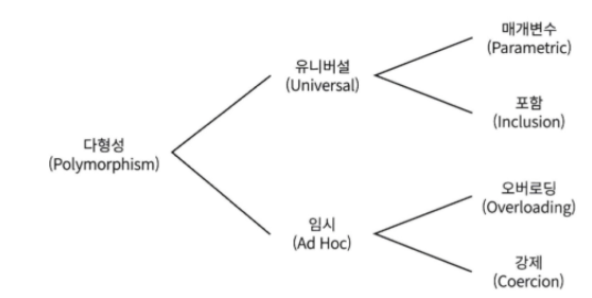

- 오버로딩

  ```java
    public class Money {
      public Money plus(Money amount) {}
      public Money plus(long amount) {}
    }
  ```

- 강제 다형성

  - 언어가 지원하는 자동적인 타입 변환이나, 동일한 연산자를 다양한 타입에 사용할 수 있는 방식

  ```java
    3 + 3 = 6
    '짐베는' + '재현님' = '짐베는재현님'
  ```

- 매개변수 다형성

  - 임의의 타입을 선언한 후 사용시점에 구체적인 타입으로 지정하는 방식

  ```java
    List<String> listA = new ArrayList<String>();
    List<int> listB = new ArrayList<int>();
    List<long> listC = new ArrayList<long>();
  ```

- 포함 다형성

  - 메시지가 동일하더라도 객체의 타입에 따라 실제로 수행되는 행동이 달라지는 능력. 우리가 알고있는 다형성

  ```java
    public class Movie {
      private DiscountPolicy discountPolicy;
      public Money calculateMoneyFee(Screening screening) {
        return fee.minus(discountPolicy.calculateDiscountAmount(screening));
      }
    }
  ```

- 다형성을 구현하는 가장 일반적인 방법은 상속을 사용하는 것. 상속의 **진정한 목적은 코드 재사용이 아니라 다형성을 위한 서브타입 계층을 구축**하는 것이다.
- 이번 장의 목표는 포함 다형성의 관점에서 런타임에 상속 계층 안에서 적절한 메서드를 선택하는 방법을 이해하는 것이다.

### 12.2 상속의 양면성

- 상속이 무엇이고 언제 사용하는지를 이해해야 하는데, 상속의 목적은 코드 재사용이 아니다. 상속은 **다형성을 가능하게 하는 타입 계층을 구축하는게 목적**이다.
- 상속을 이해하는데 필요한 몇 가지 개념을 살펴보자.
  - 업캐스팅
  - 동적 메서드 탐색
  - 동적 바인딩
  - self 참조
  - super 참조
- 상속을 사용한 강의 평가

  - 상황
    - `Pass:3 Fail:2, A:1 B:1 C:1 D:0 F:2` 결과를 출력하는 프로그램을 작성해야 함
    - `Pass:3 Fail:2` 를 출력하는 Lecture 클래스가 이미 존재. Lecture를 재사용하면 될 듯

  ```java
    public class Lecture {
      private int pass;
      private String title;
      private List<Integer> scores = new ArrayList<>();

      public Lecture(String title, int pass, List<Integer> scores) {
        this.title = title;
        this.pass = pass;
        this.scores = scores;
      }

      /** 평균 계산 */
      public double average() {}

      public List<Integer> getScores() {}

      public String evaluate() {
        return String.format("Pass:%d Fail:%d", passCount(), failCount());
      }
    }

    // 클라이언트 호출 코드
    Lecture lecture = new Lecture("오브젝트", 99, Arrays.asList(80, 84, 11, 59, 100));
  ```

  - 상속을 이용해 Lecture 클래스 재사용하기

    - Lecture 클래스는 새로운 기능을 구현하는데 필요한 데이터와 메서드를 포함하고 있다.

    ```java
      public class GradeLecture extends Lecture {
        private List<Grade> grades;

        public GradeLecture(String name, int pass, List<Grade> grades, List<Integer> scores) {
          super(name, pass, scores);
          this.grades = grades;
        }

        @Override
        public String evaluate() {
          return super.evaluate() + ", " + gradesStatistics();
        }

        public double average(String gradeName) {
          return grades().stream().~~~
        }
      }
    ```

    - 주목할 부분은 `GradeLecture, Lecture`에 구현된 **evaluate** 메서드 시그니처가 완전히 동일 하다는 것.
      - 부모/자식 클래스가 동일한 메서드를 가질 경우, **자식 클래스의 메서드 우선순위가 더 높다**. 즉, 자식 클래스의 메서드가 실행된다.
      - 이처럼 자식 클래스안에 부모 클래스의 메서드를 재정의해서 새로운 기능으로 대체하는 것을 **메서드 오버라이딩**이라고 부른다.
      - average 함수처럼 메서드 이름은 동일하지만 시그니처가 다른 메서드를 **메서드 오버로딩**이라고 부른다.

  - **데이터 관점의 상속**
    - 데이터 관점에서 상속은 자식 클래스의 인스턴스 안에 부모 클래스의 인스턴스를 포함하는 것
  - **행동 관점의 상속**
    - 부모 클래스의 일부 메서드를 자식 클래스의 메서드로 포함시키는 것을 의미하며 일반적으로 **부모의 모든 public 메서드**는 자식 메서드에 포함된다.
    - 실제로 자식 클래스 코드에 부모 클래스의 코드가 합치거나 복사하는 작업이 수행되는 것은 아니다. **런타임**에서 자식 클래스에 정의되지 않은 메서드가 호출되면 **부모 클래스 안에서 탐색**하기 때문이다.
    - 아래는 Lecture 인스턴스를 2개 생성한 후의 메모리 상태를 개념적으로 표현한 것이다. 각 객체는 `class`라는 포인터를 가지며, 이 포인터로 자신의 클래스 정보에 접근할 수 있다. 또한 `parent` 이름의 포인터로 상속 계층에 따라 부모 클래스의 정의로 이동하는 것이 가능하다.
      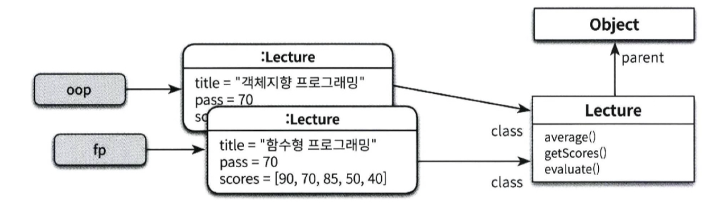
    - 아래는 GradeLecture 인스턴스를 생성했을 떄의 메모리 구조다. 이 그림은 개념적인 그림으로 구체적인 구현과 메모리 구조는 언어나 플랫폼에 따라 다르다.
      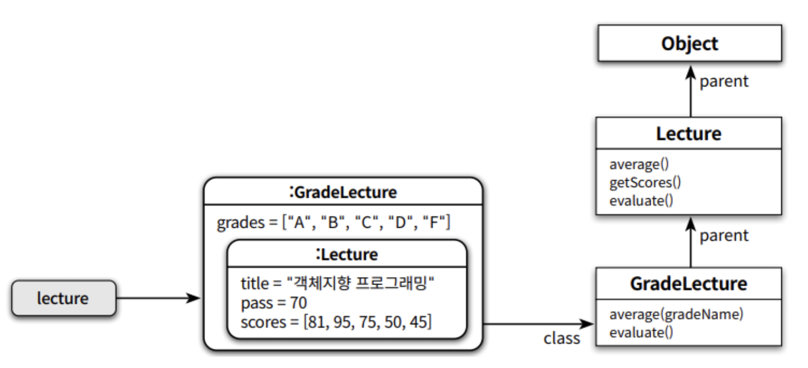

### 12.3 업캐스팅과 동적 바인딩

- 같은 메시지, 다른 메서드

```java
  public class Professor {
    private String name;
    private Lecture lecture;

    public Professor(String name, Lecture lecture) {
      this.name = name;
      this.lecture = lecture;
    }

    public String compileStatistics() {
      return String.format("%s %s - Avg: %.1f", name, lecture.evaluate(), lecture.average());
    }
  }

  Professor professor = new Professor("컴퓨터구조", new Lecture("페이지와 세그먼트", 100, Arrays.asList(40, 50, 60)));
  Professor professor2 = new Professor("컴퓨터구조", new GradeLecture(
    "페이지와 세그먼트",
    100,
    Arrays.asList(new Garde("A", 100, 95), new Garde("B", 88, 70)),
    Arrays.asList(40, 50))
  );

  professor.compileStatistics();  // Lecture의 evaluate 실행
  professor2.compileStatistics(); // GradeLecture evaluate 실행
```

- 코드 안에 선언된 타입과 무관하게 실제로 메시지를 수신하는 객체의 타입에 따라 실행되는 메서드가 달라질 수 있는 것은 **업캐스팅과 동적 바인딩**이라는 메커니즘이 작용하기 때문이다.
  - **업캐스팅**
    - 부모 타입으로 선언된 변수에 자식의 인스턴스를 할당하는 것이 가능하다.
    - 컴파일러는 명시적 타입 변환 없이도 자식이 부모 클래스를 대체할 수 있도록 허용한다.
    - 반대로 부모를 자식 클래스로 변환하기 위해서는 명시적으로 타입 캐스팅이 필요한데 이를 **다운캐스팅**이라고 부른다.
      - `GradeLecture gradeLecture = (GradeLecture)lecture`
  - **동적 바인딩**
    - 메시지를 수신하는 **객체의 타입에 따라 실행되는 메서드가 결정**된다. 메서드를 컴파일 시점이 아니라 **런타임 시점에 결정**하기 때문에 가능하다.
    - 컴파일타임에 호출할 함수를 결정하는 방식을 정적 바인딩이라고 부른고, 객체지향 언어에서는 호출함 함수를 런타임에 결정하는데 동적 바인딩 or 지연 바인딩이라 부른다.

### 12.4 동적 메서드 탐색과 다형성

- 객체가 메시지를 수신하면 컴파일러가 **self라는 변수**를 생성해 메시지를 수신한 객체를 가리키도록 설정한다.
  - 동적 메서드 탐색은 self가 가리키는 객체의 클래스부터 시작해, 상속 역방향으로 이뤄지며 메서드 탐색이 중료되면 self는 자동으로 소멸된다.
  - 아래는 메시지를 수신한 시점의 `GradeLecture` 인스턴스 메모리 상태를 나타낸 것으로, 메서드를 탐색하기 위해 self가 가리키는
    `GradeLecture` 클래스부터 상속 관계를 따라 메서드를 탐색한다.
    - 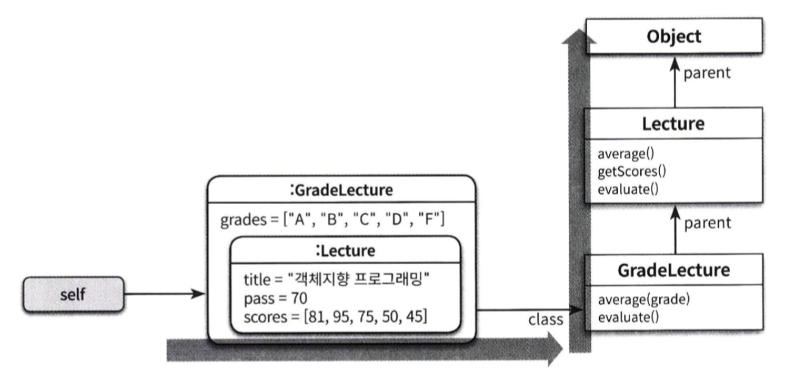
  - 다형성에서 실행 될 메서드를 찾기 위해, 자식 클래스부터 상속 계층을 따라 부모의 메소드를 탐색하고, 어떤 메서드를 실행시킬지는 런타임 시점에 이뤄지며, **메서드를 탐색하는 경로는 컴파일러가 임의로 만든 self 참조를 이용해 결정**된다.
- 동적인 문맥

  - 아래 코드에서 `getEvaluation` 메서드를 호출한다고 표현했지만, 정확히는 현재 객체에게 `getEvaluation` 메시지를 전송하는 것이다.

    ```java
      public class Lecture {
        // stats 메서드는 부모만 있음
        public String stats() {
          return String.format("Evaluation Method: %s", getEvaluation());
        }

        public String getEvaluation() {
          return "WTF";
        }
      }

      public class GradeLecture extends Lecture {
        @Override
        public String getEvaluation() {
          return "This part needs a lot of images.. WTF";
        }
      }
    ```

  - 여기서 말하는 현재 객체란 무엇일까? 바로 self가 가리키는 객체다.
    - 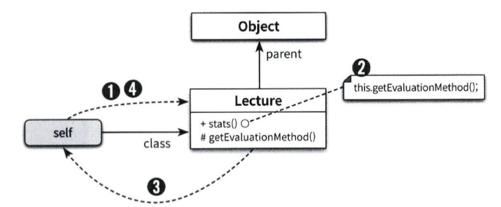
    - 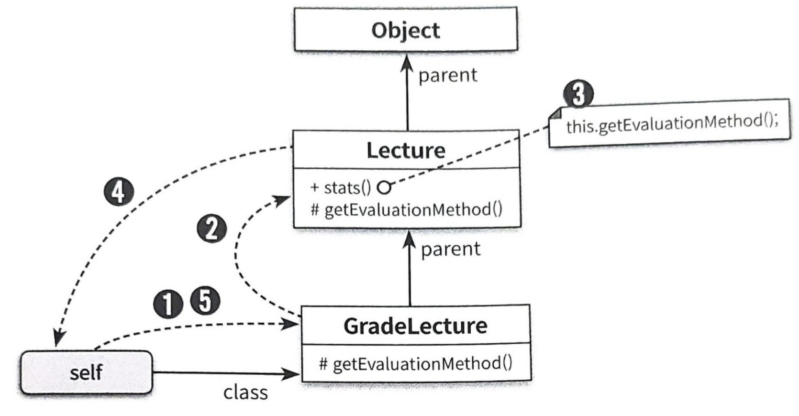

- 이해할 수 없는 메시지
  - 상속 계층의 정상까지 온 메시지를 처리할 수 없다는 걸 알게 되면 **정적 타입 언어는 컴파일 과정에서 에러**가 발생하고,
    **동적 타입 언어는 self 참조가 가리키는 현재 객체에게 메시지를 전송**한다. 이 메시지는 상속 계층을 올라가 최상위 클래스에서 예외를 던지게 된다.
- self 대 super
  - super는 이 클래스의 **부모 클래스에서부터 메서드 탐색을 시작하세요** 라는 뜻이다.
  - self가 실행할 메서드를 탐색할 위치를 동적으로 결정하는데 비해 super는 항상 해당 클래스의 부모 클래스에서부터 메서드 탐색을 시작한다. 즉 self는 메서드 탐색을 동적으로 결정해야 하지만 super는 컴파일 시점에 미리 결정해 놓을 수 있다.

### 12.5 상속 대 위임

- 다형성은 self 참조가 가리키는 객체에게 메시지를 전달하는 특성을 기반으로 한다. 동일한 메시지를 전송하더라도 self 참조가 가리키는 객체의 클래스가 무엇이냐에 따라 문맥이 달라진다.
- 포워딩과 위임

```ruby
class Lecture
  def initialize(name, scores)
    @name = name
    @scores = scores
  end

  def stats(this)
    "Evaluation Method: #{this.getEvaluationMethod()}"
  end

  def getEvaluationMethod()
    "Pass or Fail"
  end

class GradeLecture
  def initialize(name, scores)
    @name = name
    @scores = scores
  end

  def stats(this)
    @Parent.stats(this) // self 참조를 부모에게 전달
  end

  def getEvaluationMethod()
    "Grade"
  end
```

- `GradeLecture`는 stats 메서드를 직접 처리하지 않고 부모에게 요청한다. 이처럼 **self 참조를 인자로 전달해** 다른 객체의 메서드를 실행하는 것을 **위임**이라고 부르고, self 참조 없이 기능을 대신 수행해라 하는 것을 **포워딩**이라고 한다.
- `클래스 기반의 OOP 언어`들이 self 참조를 자동으로 전달하는 것처럼, `프로토타입 기반의 OOP 언어`들은 위임을 통해 객체 사이의 self 참조를 자동으로 전달한다.

```js
function Lecture(name, scores) {
  this.name = name;
  this.scores = scores;
}

Lecture.prototype.stats = function () {
  return 'Evaluation Method: ' + this.getEvaluationMethod();
};

Lecture.prototype.getEvaluationMethod = function () {
  return 'Pass or Fail';
};

function GradeLecture(name, scores) {
  this.name = name;
  this.scores = scores;
}

// prototype 설정을 통해 GradeLecture 객체들이 Lecture에 정의된 모든 속성과 함수에 접근이 가능하다.
GradeLecture.prototype = new Lecture();

GradeLecture.prototype.constructor = GradeLecture;

GradeLecture.prototype.getEvaluationMethod = function () {
  return 'Grade';
};

// 호출 코드
const gradeLecture = new GradeLecture('OOP', [1, 2, 3]);
gradeLecture.stats();
```

- 자바스크립트로 `getEvaluationMethod`가 실행될 때, 상속과 마찬가지로 self 참조가 가리키는 현재 객체에서부터 다시 메서드 탐색을 시작한다.
- 동적 메서드 탐색은, **클래스 기반의 언어인 경우 상속**을 통해 위임을 처리하고, **자바스크립트는 프로토타입 체인**을 통해 메시지에 대한 위임을 처리한다. 자바스크립트는 클래스가 존재하지 않기 때문에 객체들 사이의 메시지 위임을 통해 다형성을 구현한다. 이건 OOP에서 클래스가 필수 요소가 아니라는 사실을 알 수 있고, 상속 이외의 방법으로도 다형성을 구현할 수 있다.
- 대부분의 OOP 언어들이 클래스에 기반하고 있지만, 앞의 프로토타입 언어처럼 위임을 통해 객체 수준에서 상속을 구현하는 언어도 있다는 것을 기억하자. 중요한 것은 둘 다, **기본개념과 메커니즘을 공유**한다는 점이고 다형성과, 상속, 객체지향을 바라보는 시각이 달라지길 바란다.

## 13. 서브클래싱과 서브타이핑

- 객체기반 프로그래밍은 상태와 행동을 캡슐화한 객체를 조합해서 프로그램을 구성하는 방식이다. 객체지향 프로그래밍은 **상속과 다형성을 지원한다는 점**에서 객체기반 프로그래밍과 차별화된다.

### 13.1 타입

- **타입은** 코드의 의미를 명확하게 전달하고 개발자의 실수를 방지하기 위해 사용된다.
- 객체지향 패러다임 관점에서는 **퍼블릭 인터페이스가 객체의 타입을 결정**한다. 따라서 동일한 퍼블릭 인터페이스를 제공하는 객체들은 동일한 타입으로 분류된다.
- 객체들이 동일한 상태를 가지더라도 퍼블릭 인터페이스가 다르면 이들은 서로 다른 타입으로 분류된다. 반대로 내부 상태는 다르지만 동일한 퍼블릭 인터페이스를 가진다면 동일한 타입으로 분류된다.

### 13.2 타입 계층

- 타입 사이의 포함관계
  - 수학에서 집합은 다른 집합을 포함할 수 있다. 타입 역시 객체들의 집합이기 때문에 다른 타입을 포함하는 것이 가능하다.
  - 타입 계층을 구성하는 두 타입간에 더 일반적인 타입을 **슈퍼타입** 이라고 부르고, 더 특수한 타입을 **서브타입**이라 부른다.
- 객체지향 프로그래밍과 타입 계층
  - 더 일반적인 퍼블릭 인터페이스를 가지는 객체들은 특수한 퍼블릭 인터페이스를 가지는 객체들의 슈퍼 타입이다.
  - 서브타입의 인스턴스 집합은 슈퍼타입의 부분집합이기 때문에 **서브타입의 인스턴스는 슈퍼타입의 인스턴스로 간주될 수 있다**. 이 사실이 이번 장의 핵심이다.

### 13.3 서브클래싱과 서브타이핑

- **언제 상속을 사용**해야 하는가?
  - 마틴 오더스키는 다음 두 질문에 예라고 답할 수 있는 경우에만 상속을 사용하라고 조언한다.
    - 상속관계가 is-a 관계를 모델링하는가?
      - 일반적으로 자식 클래스는 부모 클래스다라고 말 할 수 있다면 상속 후보로 간주할 수 있다.
    - 클라이언트 입장에서 부모 클래스의 타입으로 자식 클래스를 사용해도 무방한가?
      - 상속 계층을 사용하는 입장에서 부모 클래스와 자식 클래스의 차이점을 몰라야 한다. 이를 자식/부모 클래스 사이의 행동 호환성이라고 한다.
- is-a 관계
  - is-a 괸계가 생각처럼 직관적이고 명쾌한 것은 아니다. 새와 펭귄을 보면 is-a 직관을 쉽게 배신한다는 사실을 알 수 있다.
  - 펭귄은 새다. 새는 날 수 있다. 하지만 펭귄은 날 수 없다. 이 예는 is-a 말을 너무 단편적으로 받아들일 경우 혼란이 벌어질 수 있다는 것을 잘 보여준다.
  - 따라서 **is-a로 표현할 수 있더라도 일단은 상속을 사용할 예비 후보** 정도로 생각해라. 급하게 상속을 적용하려고 서두르지 말자.
- 행동 호환성
  - 행동 호환성을 판단하는 기준은 클라이언트 관점이다. 클라이언트가 두 타입이 동일하게 행동할것이라 기대한다면 두 타입을 타입 계층으로 묶을 수 있다.
- 클라이언트의 기대에 따라 계층 분리하기

  - 행동 호환성을 만족하지 않는 상속 계층을 유지하면서 클라이언트의 기대를 충족하는 방법을 찾기는 어렵다. 문제를 해결하는 방법은 클라이언트 기대에 따라 상속 계층을 분리하는 것이다.
  - flyBird 메서드는 모든 새가 날 수 있다고 가정하기에, 펭귄 인스턴스는 flyBird에 전달되서는 안 된다. 따라서 날 수 있는 새와 날 수 없는 새를 구분할 수 있게 상속 계층을 분리하면 클라이언트를 만족시킬 수 있다.

  ```java
    public class Bird {}
    public class FlyingBird extends Bird {
      public void fly {}
    }

    public class Penguin extends Bird {}

    // FlyingBird 타입을 이용해 날 수 있는 새만 인자로 전달돼야 한다는 사실을 코드에 명시
    public void flyBird(FlyingBird bird) {
      bird.fly();
    }
  ```

  - 요점은 요구사항 속에서 클라이언트가 기대하는 행동에 집중하라는 것이다. 두 **클래스 사이에 행동이 호환되지 않는다면** 상속을 사용해서는 안 된다.

- 서브클래싱과 서브타이핑
  - 상속을 코드 재사용에 사용한다면 이를 **서브클래싱**, 상속을 다형성을 위한 타입 계층을 구성하기 위해 사용한다면 **서브타이핑**이라 부른다.
  - 서브클래싱과 서브타이핑을 나누는 기준은 **상속을 사용하는 목적**이고, 나쁜 설계로 예를 든 상속은 서브클래싱에 속한다.
  - 서브타이핑 관계가 유지되기 위해서는 서브타입이 슈퍼타입이 하는 모든 행동을 동일하게 할 수 있어야 한다. 즉 행동호환성을 만족시켜야 한다.

### 13.4 리스코프 치환 원칙

- 1988년 바바라 리스코프는 올바른 상속 관계의 특징을 정의하기 위해 **`리스코프 치환원칙(ISP)`** 을 발표했다. 리스코프 치환원칙에
  따르면 자식 클래스가 부모 클래스와 행동호환성을 유지함으로써 부모 클래스를 대체할 수 있도록 구현된 상속 관계만을 서브타이핑이라 불러야 한다.
- 리스코프 치환원칙에 따르면 상속 관계는 클라이언트 관점에서 자식 클래스가 부모 클래스를 대체할 수 있을때만 올바르다.
- is-a 관계로 표현된 문장을 볼 때마다 문장 앞에 **`클라이언트 입장에서`** 라는 말이 빠져있다고 생각하라. 행동을 고려하지 않은 두 타입이 is-a 관계라고 해서 상속 관계로 연결하지 마라. 이름이 아니라 행동이 먼저다.
- 클래스 상속은 타입 계층을 구현할 수 있는 다양한 방법 중 하나이다. 자바나 C#의 인터페이스, 스칼라의 트레이트, 동적 타입 언어의 덕 타이핑 기법을 사용하면 상속을 사용하지 않고 서브타이핑 관계를 구현할 수 있다.

### 13.5 계약에 의한 설계와 서브타이핑

- 클라이언트와 서버 사이의 협력을 **`계약에 의한 설계`** 라고도 부른다. 계약에 의한 설계는 클라이언트가 정상적으로 메서드를 실행하기 위해 만족시켜야 하는 사전조건, 메서드가 실행된 후에 서버가 클라이언트에게 보장해야 하는 사후조건, 메서드 실행 전/후 인스턴스가 만족시켜야 하는 클래스 불변식 세 가지 요소로 구성된다.
- 리스코프 치환원칙은 서브타입이 슈퍼타입을 대체할 수 있어야 하고, 클라이언트가 차이점을 인식하지 못한 채, 슈퍼타입의 인터페이스를 이용해 서브타입과 협력할 수 있어야 한다고 말한다. 클라이언트 입장에서 서브타입은 정말 슈퍼타입의 한 종류인 것이다.

## 14. 일관성 있는 협력

- 가능하면 **유사한 기능을 구현하기 위해 유사한 협력 패턴**을 사용하라. 객체들의 협력이 일관성 있는 유사한 패턴을 따른다면 시스템을 이해하고 확장하기 위해 요구되는 부담을 줄일 수 있다. 일관성 있는 협력 패턴은 코드가 이해하기 쉽고 직관적이며 유연해진 다는 것이 이번 장의 주제다.

### 14.1 핸드폰 과금 시스템 변경하기

- 11장에서 구현한 핸드폰 과금 시스템의 요금 정책을 수정한다고 가정하자. 기본 정책에 일반 요금제와 심야 요금제 2가지가 있었다. 이번 장에서는 고정요금 방식, 시간대별 방식, 요일별 방식, 구간별 방식 4가지로 확장할 것이다.
- 코드로 구현한 후 가장 큰 문제점은 유사한 문제를 해결하고 있음에도 설계의 일관성이 없다는 것이다. 기본 정책을 구현한다는 공통의 목적이 있지만 정책을 구현하는 방식이 완전히 다르다. 즉 개념적으로는 연관돼 있지만 구현 방식에 있어서는 제각각이다.
- 비일관성은 새로운 구현을 추가해야 하는 상황과 기존의 구현을 이해해야 하는 상황에서 발목을 잡는다. **결론적으로 유사한 기능은 유사한 방식으로 구현해야 한다.**

### 14.2 설계에 일관성 부여하기

- 일관성 있는 설계를 만드는데 가장 훌륭한 조언은 **다양한 설계 경험을 익히라는 것**이다. 두 번째 조언은 널리 알려진 디자인 패턴을 학습하고 변경이라는 문맥안에서 디자인 패턴을 적용해 보라는 것이다. 디자인 패턴은 특정한 변경에 대해 일관성 있는 설계를 만들 수 있는 경험 법칙을 모아놓은 일종의 설계 템플릿이다.

```java
  if (discountable) {
    switch(movie.getMovieType()) {
      case AMOUNT_DISCOUNT:
        // 금액 할인 정책
      case PERCENT_DISCOUNT:
        // 비율 할인 정책
    }
  } else {
    // 할인 적용이 불가능한 경우
  }
```

- 위 코드에는 할인 조건과 할인 정책을 결정하는 두 개의 조건이 존재한다. 이 설계가 나쁜 이유는 변경의 주기가 서로 다른 코드가 한 클래스 안에 뭉쳐있기 때문이다.
- 객체지향은 조금 다른 접근 방법을 취한다. 객체지향에서 **변경을 다루는 전통적인 방법은 조건 로직을 객체 사이의 이동으로 바꾸는 것**이다. 아래에서 Movie는 현재의 할인 정책이 어떤 종류인지 확인하지 않는다. 단순히 현재의 할인 정책을 나타내는 `discountPolicy`에 필요한 메시지를 보낼 뿐이다.

```java
public class Movie {
  private DiscountPolicy discountPolicy;
  public Money calculateMovieFee(Screening screening) {
    return fee.minus(discountPolicy.calculateDiscountAmount(screening));
  }
}
```

- 다형성은 이런 조건로직을 객체 사이의 이동으로 바꾸기 위해 객체지향이 제공하는 설계 기법이다.
- 큰 메서드 안에 뭉쳐있던 조건 로직들을 변경의 맞춰 작은 클래스들로 분리하고 나면 인스턴스들 사이의 협력 패턴에 일관성을 부여하기 더 쉬워진다.
- Movie와 `DiscountPolicy, DiscountCondition` 사이의 협력 패턴은 변경을 기준으로 클래스를 분리함으로써 어떻게 일관성 있는 협력을 얻을 수 있는지를 잘 보여준다. 이 협력 패턴은 말 그대로 일관성이 있기 때문에 이해하기 쉽다.
- 캡슐화 다시 살펴보기

  - 많은 사람들은 캡슐화를 생각하면 데이터 은닉을 떠올린다. 데이터 은닉은 공개된 메서드를 통해서만 객체 내부에 접근할 수 있게 객체의 내부 상태를 숨기는 기법이다. 그러나 **캡슐화는 데이터 은닉 이상**이다. SW 안에서 변할 수 있는 모든 개념을 감추는 것이다.
  - 캡슐화의 대표적인 예는 **퍼블릭 인터페이스와 구현을 분리**하는 것이다. 객체를 구현한 개발자는 내부 구현을 수정하길 원하고, 객체와 협력하는 클라이언트 개발자는 객체의 인터페이스가 변하지 않길 원한다. 따라서 자주 변경되는 내부 구현을 안정적인 퍼블릭 인터페이스 뒤로 숨겨야 한다.
  - 다시 강조하지만 캡슐화란 단순히 데이터를 감추는 것이 아니다. SW안에서 **변할 수 있는 어떤 개념이라도 감추는 것**이다.

  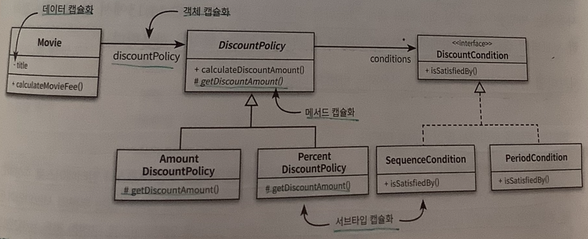

  - 위 그림에는 다음과 같이 다양한 종류의 캡슐화가 공존한다.
    - **데이터 캡슐화:** movie의 title은 private이기 때문에 외부에서 직접 접근할 수 없다. 클래스는 내부에 관리하는 데이터를 캡슐화한다.
    - **메서드 캡슐화:** **`DiscountPolicy`** 클래스의 getDiscountAmount 메서드는 protected다. 클래스 외부에서 이 메서드에 직접 접근할 수 없고 클래스 내부와 서브 클래스에만 접근 가능하다.
    - **객체 캡슐화:** Movie 클래스의 **`DiscountPolicy`** 타입의 인스턴스 변수 **`discountPolicy`**를 포함한다. 이 변수는 private이기 때문에 Movie와 DiscountPolicy 사이의 관계를 변경해도 외부에는 영향을 미치지 않는다. 눈치가 빠르다면 객체 캡슐화가 합성을 의미하는 것을 눈치챘을 것이다.
    - **서브타입 캡슐화:** Movie는 DiscountPolicy는 알지만 **`AmountDiscountPolicy와 PercentDiscountPolicy에`** 대해서는 알지 못한다. 그러나 실행 시점에서는 이 클래스의 인스턴스 들과 협력할 수 있다. 서브타입 캡슐화가 다형성의 기반이 된다는 것을 알 수 있다.

### 14.3 일관성 있는 기본 정책 구현하기

- 일관성 있는 협력을 만들기 위한 **첫 번째 단계는 변하는 개념과 변하지 않는 개념을 분리**하는 것이다. 변하지 않는 부분을 분리했기 때문에 변하지 않는 부분을 재사용할 수 있다. 그리고 새로운 기능을 추가하기 위해 변하는 부분만 구현하면 되기 때문에 원하는 기능을 쉽게 완성할 수 있다.
- 일관성 있는 **협력의 핵심은 변경을 분리하고 캡슐화**하라는 것이다. 애플리케이션에서 유사한 기능에 대한 변경이 지속적으로 발생하고 있다면 변경을 캡슐화 할 수 있는 적절한 추상화를 찾은 후, 이 추상화에 변하지 않는 공통적인 책임을 할당하라.

## 15. 디자인 패턴과 프레임워크

- SW 설계에서 반복적으로 발생하는 문제에 대해 적용할 수 있는 해결 방법을 디자인 패턴이라고 부른다. 디자인 패턴의 목적은 설계를 재 사용하기 위한 것이라면 프레임워크는 설계와 코드를 함꼐 재사용하기 위한 것이다. 프레임워크는 어플리케이션의 아키텍처를 구현 코드의 형태로 제공한다.

### 15.1 디자인 패턴과 설계 재사용

- 패턴의 가치는 경험을 통해 축적된 실무 지식을 효과적으로 요약하고 전달할 수 있다는 점이다. 책상 위에서 탄생한 이론이나 원리와 달리 패턴은 치열한 실무에서 입증된 자산이다.
- 중요한 것은 패턴을 따르면 특정한 상황에 적용할 수 있는 설계를 쉽고 빠르게 떠올릴 수 있다는 사실이다. 특정한 상황에 적용 가능한 패턴을 잘 알고 있다면 객체들의 역할과 책임, 협력 관계를 손쉽게 구성할 수 있다.
- 디자인 패턴에서 중요한 것은 구현 방법이나 구조가 아니다. 어떤 디자인 패턴이 어떤 변경을 캡슐화 했는지를 이해하는 것이 중요하다. 그리고 각 디자인 패턴이 변경을 캡슐화 하기 위해 어떤 방법을 사용하는지를 이해하는 것이 중요하다.
- 패턴은 공통적인 문제에 적절한 해법을 제공하지만, 공통적인 해법이 우리가 직면한 문제에 적합하지 않을 수 있다. 패턴은 복잡성의 가치가 단순성을 넘어설 때만 사용되어야 한다. 또한 코드를 공유하는 사람들이 적용된 패턴을 알아야 한다. 패턴을 적용할 때는 함께 작업하는 사람들이 패턴에 익숙한지 여부를 확인하고 그렇지 않다면 설계에 대한 지식과 더불어 패턴에 대한 지식도 함께 공유하는 것이 필요하다.

### 15.2 프레임워크와 코드 재사용

- 디자인 패턴은 재사용 가능한 설계 아이디어를 제공한다. 따라서 디자인 패턴을 적용하려면 언어의 특성에 맞춰 가공해야 하고 매번 구현 코드를 재작성해야 하는 단점이 있다.
- 재사용 관점에서 설계 재사용보다 좋은 방법은 코드 재사용이다. 더 이상적인 재사용은 설계 재사용과 코드 재사용을 조합하는 것이다. 설계를 재사용하면서도 유사한 코드를 반복적으로 구현하는 문제를 피하기 위해 나온 것이 프레임워크다.
- 의존성 역전 원리는 전통적인 설계 방법과 객체지향을 구분하는 가장 핵심적인 원리다. 의존성 역전 원리에 따라 구축되지 않은 시스템은 재사용 할 수도 없으며 변경에 유연하게 대처할 수도 없다.
- 의존성을 역전시킨 객체지향 구조에서는 프레임워크가 애플리케이션에 속하는 서브클래스의 메서드를 호출한다. 따라서 어플리케이션에서 프레임워크로 제어 흐름이 역전된다. 이를 제어 역전의 원리라고 부른다. 과거에는 우리가 직접 라이브러리의 코드를 호출했지만 객체지향 시대에서는 그저 프레임워크가 호출하는 코드를 작성해야 한다. 제어가 우리에게서 프레임워크로 넘어가버린 것이다.

## 부록 A. 계약에 의한 설계

- 인터페이스만으로는 객체의 행동에 관한 다양한 관점을 전달하기 어려울 수 있다. 이 시점이 되면 계약에 의한 설계가 주는 혜택으로 눈을 돌릴 때가 된 것이다.

### 1. 협력과 계약

- C# 같이 계약에 의한 설계 개념을 지원하는 라이브러리나 언어들은 제약 조건을 명시적으로 표현하는 것이 가능하다.

```C#
public void Reschedule(Scheduler schedule)
{
  Contract.Requires(IsSatisfied(schedule)) // C# 언어에선 이런 계약을 설정하는 문법을 지원함
}
```

- 이렇게 작성된 계약은 코드로부터 자동으로 문서화할 수도 있고, 제약 조건의 만족 여부를 실행 중에 체크할 수도 있다.

### 2. 계약에 의한 설계

- 클라이언트는 메시지 전송 전/후에 서버 상태가 정상일거라 기대한다. 계약에 의한 설계를 구성하는 세 가지 요소를 순서대로 사전조건, 사후 조건, 불변식이라고 부른다.
  - 사전조건: 메서드가 호출되기 전에 만족해야 하는 조건
  - 사후조건: 메서드가 호출된 후에 만족해야 하는 조건
  - 불변식: 항상 참이라고 보장되는 서버의 조건

### 3. 계약에 의한 설계와 서브타이핑

- 계약에 의한 설계는 클라이언트가 만족해야 하는 사전조건과 클라이언트 관점에서 서버가 만족시켜야 하는 사후 조건을 기술한다.
- 리스코프 치환원칙은 슈퍼 타입의 인스턴스와 협력하는 클라이언트 관점에서 서브타입의 인스턴스가 슈퍼타입을 대체하더라도 협력에 지장이 없음을 의미한다. 따라서 서브타입이 리스코프 치환원칙을 만족시키기 위해 클라이언트와 슈퍼타입 간에 체결된 계약을 준수해야 한다고 정리할 수 있다.
- 일찍 실패하기
  - 마이너스 금액을 그대로 사용하는 것보다 처리를 종료하는 것이 올바른 선택이다. 불가능한 뭔가가 발생했다는 것을 코드가 발견한다면 프로그램은 더 이상 유효하지 않다고 할 수 있다. 이 시점 이후로 하는 일은 모두 수상쩍게 된다. 일반적으로 죽은 프로그램이 입히는 피해보다 절름발이 프로그램이 끼치는 피해가 훨씬 크다.

## 부록 B. 타입 계층의 구현

### 클래스를 이용한 타입 계층 구현

- 타입은 객체의 퍼블릭 인터페이스를 가리키기 때문에 클래스는 객체의 타입과 구현을 동시에 정의하는 것과 같다. 이게 객체지향 언어에서 클래스를 사용자 정의 타입 이라고 부르는 이유다.
- 타입을 구현할 수 있는 방법이 단 한가지만 존재하는 경우에는 타입과 클래스를 동일하게 취급해도 무방하다. 반대로 타입을 구현할 수 있는 방법이 다양해지면 클래스와 타입은 갈라지기 시작한다.
- 어떤 클래스의 퍼블릭 인터페이스는 동일하지만 다른 방식으로 구현해야 하는 객체가 필요하다고 가정하자. 다시 말해 구현은 다르지만 동일한 타입으로 분류되는 객체가 필요한 것이다. 이를 할 수 있는 가장 간단한 방법은 상속을 이용하는 것이다.
- 앞에서 살펴본 것 처럼 상속은 자식 클래스를 부모 클래스에 강하게 결합시키기 때문에 추상 클래스를 상속 받거나 인터페이스를 구현하는 방법을 사용하길 바란다.

### 인터페이스를 이용한 타입 계층 구현

- 상속으로 인한 결합도 문제를 피하고 다중 상속이라는 구현 제약도 해결할 수 있는 방법은 클래스가 아닌 인터페이스를 사용하는 것이다.

  ```java
    public interface GameObject {
      String getName();
    }

    // 화면 표시라는 별도의 타입
    // Displayable 타입의 모든 인스턴스는 GameObject 타입의 인스턴스 집합에도 포함된다. 이처럼 인터페이스가 다른
    // 인터페이스를 확장하도록 만들면 슈퍼 타입과 서브 타입간의 타입 계층을 구성할 수 있다.
    public interface Displayable extends GameObject {
      Point getPosition();
      void update(Graphics graphics);
    }

    // 충돌로 인해 제약받는 타입
    public interface Collidable extends Displayable {
      boolean collieWith(Collidable other)
    }

    /***** 구현 클래스 *****/
    public class Player implements Collidable {
      @Override
      public String getName() {}

      @Override
      public String collieWith() {}

      @Override
      public String getPosition() {}

      @Override
      public String update() {}
    }

    public class Monster implements Collidable {
      @Override
      public String getName() {}

      @Override
      public String collieWith() {}

      @Override
      public String getPosition() {}

      @Override
      public String update() {}
    }
  ```

- Player, Monster 클래스는 다른 클래스지만 동일한 Collidable 인터페이스를 구현하고 있기 때문에 동일한 메시지에 응답할 수 있다. 따라서 다른 클래스지만 타입은 동일하다. 중요한 것은 인터페이스를 이용해 타입 계층을 구현할 수 있다는 사실이다.
- 객체의 클래스는 객체의 구현을 정의한다. 클래스는 상태와 오퍼레이션 구현 방법을 정의하고 객체의 타입은 인터페이스만을 정의하는 것으로 객체가 반응할 수 있는 오퍼레이션의 집합을 정의한다. 하나의 객체가 여러 타입을 가질 수도 있고 다른 클래스들이 동일한 타입을 가질 수 있다. 즉 객체의 구현은 다를지라도 인터페이스는 같을 수 있다.

### 추상 클래스를 이용한 타입 계층 구현

- 클래스 상속을 이용해 구현을 공유하면서도 결합도의 부작용을 피하는 방법이 있는데 바로 추상 클래스를 사용하는 방법이다.
  영화 예매 시스템엫서 할인 정책을 구현하기 위한 DiscountPolicy를 떠올려보자.

```java
  public abstract class DiscountPolicy {
    private List<DiscountCondition> conditions = new ArrayList()<>;
    abstract protected Money getDiscountAmount(Screening screening);
  }

  public class AmountDiscountPolicy extends DiscountPolicy {
    @Override
    protected Money getDiscountAmount(Screening screening) {
      return discountAmount;
    }
  }

  public class PercentDiscountPolicy extends DiscountPolicy {
    @Override
    protected Money getDiscountAmount(Screening screening) {
      return screening.getMovieFee().times(percent);
    }
  }
```

- 구체 클래스로 상속하는 방법과 추상 클래스로 타입을 정의해서 상속받는 방법에는 두 가지 차이가 있다. 바로 추상화의 정도와 상속을 사용하는 의도이다.
  - 첫 번째 구체 클래스 상속은 부모의 내부 구현이 바뀌면 자식 클래스도 함께 변경될 가능성이 높다. 반대로 추상 클래스의 경우 내부 구현이 아닌 추상 메서드의 시그니처에만 의존한다. 자식 클래스들은 부모인 DiscountPolicy가 어떻게 구현돼 있는지 알 필요가 없다.
  - 한 가지 조언은 모든 구체 클래스의 부모 클래스를 항상 추상 클래스로 만들기 위해 노력하라는 것이다. 의존하는 대상이 추상적일 수록 결합도는 낮아지고 변경에 의한 영향이 줄어즌다. DiscountPolicy의 자식들은 추상 메서드의 명세가 변경되지 않는 한 영향을 받지 않는다.
  - 두 번째는 상속을 사용하는 의도다. phone은 상속을 염두에 두고 설계된 것이 아니라 코드 재사용을 위한 트릭에 가깝지만 추상 클래스인 DiscountPolicy의 유일한 목적은 자식 클래스를 추가하는 것이다. 추상 메서드만 제공함으로써 상속 계층을 쉽게 확장할 수 있게 하고 부작용을 방지할 수 있다.

### 추상 클래스와 인터페이스 결합하기

- 인터페이스와 추상 클래스를 함께 사용하는 방법은 추상 클래스만 사용하는 방법에 비해 두 가지 장점이 있다.
  - 다양한 구현 방법이 필요한 경우, 새로운 추상 클래스를 추가해 쉽게 해결이 가능하다.
  - 이미 부모 클래스가 존재하는 클래스라도, 인터페이스를 추가해 새로운 타입으로 확장할 수 있다. 만약 인터페이스 없이 추상 클래스로 구현돼 있는 경우 상속 계층을 다시 조정해야만 한다.
- 설계가 상속 계층에 얽매이지 않는 타입 계층을 요구하면 인터페이스로 타입을 정의해라. 추상 클래스로 기본 구현을 제공해서 중복 코드를 제거하라. 이런 복잡성이 필요없다면 타입을 정의하기 위해 추상클래스나 인터페이스 둘 중 하나만 사용하라.

### 덕 타이핑 사용하기

- 덕 타이핑은 주로 동적 타입 언어에서 사용하는 방법으로 덕 테스트를 프로그래밍 언어에 적용한 것이다.
- 덕 테스트는 어떤 대상의 행동이 오리와 같다면 그것을 오리라는 타입으로 취급해도 무방하다는 말이다. 따라서 객체가 어떤 인터페이스에 정의된 행동을 수행할 수 있다면 그 객체를 해당 타입으로 분류해도 문제가 없다.
- 안타깝게도 자바를 비롯한 대부분의 정적 타입 언어는 덕 타이핑을 지원하지 않는다.

```java
  public interface Employee() {
    Money calculatePay(double taxRate);
  }

  public class SalaryEmployee() {
    public calculatePay(double taxRate) {
      return basePay.minus(basePay.times(taxRate));
    }
  }

    public class HourlyEmployee() {
    public calculatePay(double taxRate) {
      return basePay.times(timeCard).minus(basePay);
    }
  }
```

- 위 코드에서 SalaryEmployee, HourlyEmployee는 calculatePay 메서드를 포함하지만 자바 같은 정적타입 언어에서는 코드 상의 타입이 동일하게 선언되어야 동일한 타입으로 취급된다. 따라서 아래와 같이 calculate 메서드의 첫 번째 인자로 SalaryEmployee, HourlyEmployee를 전달한다면 코드는 컴파일 오류가 발생한다.

```java
public Money calculatePay(Employee employee, double taxRate) {
  return employee.calculatePay(taxRate);
}

calculate(new SalaryEmployee(), 0.01); // 컴파일 에러
calculate(new HourlyEmployee(), 0.01); // 컴파일 에러
```

- 위 코드가 동작하려면 두 클래스가 Employee 인터페이스를 명시적으로 구현하게 해야 한다. 이처럼 정적 타입의 언어에서는 인터페이스만으로 타입을 추측하는게 불가능하며 모든 요소와 타입이 명시적으로 기술돼 있어야 한다. 반대로 런타임에 타입을 결정하는 동적 타입 언어는 동일한 시그니처를 가진 메서드를 구현하고 있기 떄문에 동일한 타입으로 간주될 수 있다.
- 이것이 덕 타이핑이다. calculatePay(taxRate) 라는 행동을 수행할 수 있으면 이 객체를 Employee 라고 부를 수 있는 것이다. 마치 꽥꽥거리는 모든 것을 오리라고 부르는 것처럼 말이다.
- 덕 타이핑을 사용하면 메시지 수준으로 결합도를 낮출 수 있기 때문에 유연한 설계를 얻을 수 있다. 하지만 컴파일 시점에 발견할 수 있는 오류를 실행 시점으로 미루기 때문에 코드의 안정성을 약화시킬 수 있다는 점에 주의하라.

## 부록 C. 동적인 협력, 정적인 코드

- 객체는 동적이고 프로그램은 정적이다. 객체는 시간에 따라 다른 객체와 협력하며 변화한다. 프로그램은 고정된 텍스트라는 형식 안에 있으면서도 객체의 모든 변화 가능성을 담아야 한다. 프로그램 실행구조를 표현하는 움직인 모델을 동적 모델, 코드의 구조를 담는 고정된 모델을 정적 모델이라고 부른다.
- 두 가지 모델 중에 우선해야 할 것은 동적 모델이다. 정적 모델은 동적 모델에 의해 주도되어야 하고 프로그램 코드 안에 담아지는 정적 모델은 객체 사이의 협력에 기반해야 한다.

### 도메인 모델과 구현

- 도메인이란 사용자가 프로그램을 사용하는 대상 영역을 가리킨다. 객체지향 분석 설계에서 제안하는 지침 중 하나는 소프트웨어의 도메인에 대해 고민하고 도메인 모델을 기반으로 SW를 구축하라는 것이다. 이 때 도메인 모델을 작성하는 것은 목표가 아니라 출밤점이다. SW를 만들기 위해 하는 모든 목적은 동작하는 SW를 만드는 것이다.
- 불행은 도메인 안의 개념이 제공하는 틀에 맞춰서 SW를 구축해야 한다고 생각할 때 시작된다. 중요한 것은 객체들의 협력을 지원하는 코드 구조를 만드는 것이다. 도메인의 개념을 충실히 따르는 코드가 목적이 아니다.
- 코드는 도메인의 개념이 아닌, 객체의 행동과 변경에 영향을 받는다. 분석, 설계, 구현 단계에서 세부적인 내용은 다를 수 있지만 설계의 초점은 동일하다. 모든 단계에 걸쳐 행동과 변경에 초점을 맞추라는 것이다.
